Financial Evaluation Logbook (TaaS chapter) - Harry Emes

8th November 2025
Section delegation

Group meeting split the report. My role is financial evaluation for the Testing-as-a-Service plan. From an initial discussion with teammates and some quick research, I drew up the list of aspects I will need to calculate and forecast: capex, opex, revenue, P&L and cash flow, capex inversion timing, break-even, NPV, IRR, funding and valuation. We briefly discussed dependencies and flagged Toby's market sizing as critical to several values in the model.

After the meeting I wrote a one-page dependency map: which aspects of the financial model need Toby's SOM, which need Paul's vehicle pricing, and which are entirely internal to the finance model.

11th November 2025
Initial market research

Started by working through five comparator sources. Each one gave me an estimate for several key parameters I will need for an accurate financial model. UTAC's proving ground facilities page (Millbrook and Leyland sites) gave me UK facility hire economics which will be useful for OPEX. AB Dynamics' 2024 Annual Report and Accounts gave me the EV/Revenue band I would later use for terminal value. Together these gave a comparator band of about £4k to £12k per day of equivalent activity, and we fixed our own Bronze / Silver / Gold packages at £6k / £8k / £10k as a deliberate mid band entry price that still lets the blended rate climb as the mix shifts.

I also created a citations file with URLs and access dates so I could track which sources will end up in the bibliography.

18th November 2025
Consolidating competitor notes into a single table ***add the table

Turned the previous notes into a single table specification: one row per comparator (UTAC, AB Dynamics, HORIBA MIRA, AVL, Spirent), columns for what they sell, what they charge for the closest analogue to a sold test day, and what their public EV/Revenue multiple is. Each row had to point at a primary source (the AB Dynamics 2024 annual report, the UTAC and HORIBA facility pages, AVL's company profile, Spirent's investor page) so that any number I quoted in the chapter later could be easily traced back.

22nd November 2025
Deeper financial metric research

Most of the foundational reading came out of Brealey, Myers and Allen's "Principles of Corporate Finance" (13th edition), which I used for the standard definitions of NPV, IRR, depreciation, free cash flow and discount rate, and Damodaran's "Investment Valuation" (3rd edition), which I leaned on for terminal value and exit multiple framing.

Did more research on what certain financial terms and models mean such as NPV, discount rate, IRR, P&L, depreciation etc. There were several other financial metrics I came across such as WACC from comparables, real-options valuation, Monte Carlo DCF, and LBO-style modelling however I discounted them as less relevant because they would add fake precision. WACC, real options, and Monte Carlo all need extra parameters we would have had to invent (beta, volatilities, branch probabilities).

I then made a list of all the variables I will need values for:

- Sold test days per year
- Fleet size / vehicles
- Bronze / Silver / Gold day prices (already done however need to confirm how blended day rate will change)
- Variable cost per test day
- Per-vehicle capex
- Year-one workshop setup capex
- Fixed opex baseline
- Headcount salary costs by year
- Inflation rate
- Corporation tax rate when we become profitable
- Seed and Series A sizes (and timing if modelled)
- NPV discount
- Terminal value rule, specifically peer multiples
- Possible unit-economics: CAC, revenue per customer per year, lifetime years, gross margin (if we require and have space)

Compared the variable list against the chapter plan and marked which items were "numbers we must agree as a group" versus "numbers that can be derived purely from research".

23rd November 2025
Brealey NPV chapter deep dive

Read Brealey, Myers and Allen's NPV chapter. Noted the pre-equity free cash flow convention: when an investor evaluates a project, they want the cash the project itself generates before any equity raise, otherwise the same money is being counted twice. This means our seed and Series A rounds do not belong in the FCF that feeds NPV.

The book also offerd a better insight into the discount rate as "the opportunity cost of capital rather than the cost of debt". For a venture stage company with no debt, we are comparing what an investor could earn on a comparable risk equity stake somewhere else, which is the VC hurdle rate I will pin to 20% in the NPV work later.

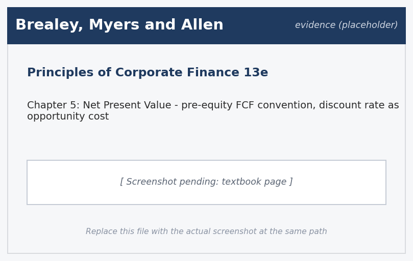

24th November 2025
Damodaran terminal value chapter

Read Damodaran's terminal value chapter and the chapter on valuation. Primary takeaway is that for a five-year forecast horizon, terminal value usually represents 60 to 80 per cent of total enterprise value, so the multiple chosen for terminal year matters enormously. The chapter explicitly warns against picking the maximum comparable multiple and instead recommends the median or a trimmed mean when the comparable set is small, which is exactly our situation with only AB Dynamics, Spirent and AVL.

Damodaran also walks through the difference between exit multiple and perpetuity growth methods for terminal value. I will use the exit multiple method because for a TaaS business with a five-year forecast it is the more honest representation than assuming perpetuity growth.

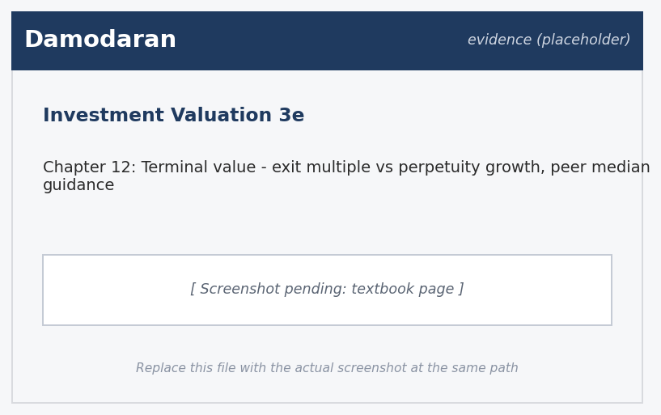

25th November 2025
Utilisation curve with Toby

Discussed with Toby and confirmed values of the increase in sold days (40, 70, 110, 150, 220) over years one to five, based on sensible percentages of TAM SAM SOM with an initial fleet of 1, 1, 2, 2, 3 (subject to a larger group discussion and may change). We also discussed how the blended day rate will increase and settled on £9.5k by year five (£7.5k → £8k → £8.5k → £9k → £9.5k), because we assume fixed tier prices (£6k / £8k / £10k) and a deliberately higher Silver/Gold mix over time driven by upsell, packaging, and sales targets. I added utilisation and fleet growth to the parameter spreadsheet.

The numerical anchor for the utilisation curve came from Toby's market chapter, which sized the serviceable obtainable market at about $26M. Our Y5 plan of 220 sold test days at a £9.5k blended rate is roughly £2.1M of revenue, which is 10 to 14 per cent of that SOM (the band reflects the GBP to USD rate used at the time). I kept the penetration deliberately in the low double digits so the chapter reads as a slice of SOM rather than a claim that we win the whole market in five years.

28th November 2025
Reed salary benchmark

Walked through Reed's 2025 automotive salaries report role by role. Reed reports an average engineer salary at ~£50k mid-band, design managers at £55 to £65k, CEO equivalent at £80 to £110k for a startup. Cross-checked against GOV.UK HMRC employer Class 1 secondary NI rates and thresholds plus workplace pensions guidance. The flat 20% addition on gross salary in the model is a deliberate overestimation to account for misc : ~15% employer secondary NI (published HMRC rate for standard category A above the Secondary Threshold), ~3% minimum employer auto-enrolment pension per GOV.UK minima, and ~2% for miscellaneous payroll frictions (software, admin, minor insured benefits, rounding).

Went with the lower end of Reed's CEO band (£75k) deliberately because at incorporation the founder takes a pay cut. The other roles use the mid-band Reed number.

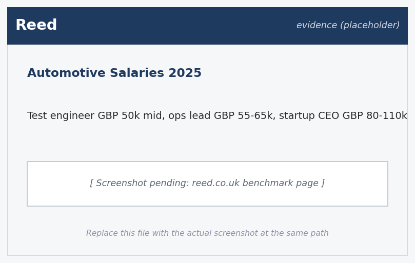

29th November 2025
Per-vehicle capex with Paul

Discussed the car expense with Paul to try to identify the total capex of each car. Walked through subsystem costs (chassis and powertrain, instrumentation, safety, trailer, spares). Agreed a headline £310k per vehicle for the chapter, with a note that instrumentation could move if we go lidar-heavy. Also a separate £50k in year one for workshop and data setup so "vehicle" stays comparable year to year. The finalised capex breakdown was stored in an excel file for future reference.

The buckets we landed on were: vehicle build (chassis, powertrain, aero) £180k, data acquisition and instrumentation £60k, safety and emergency redundancy systems £25k, trailer and transport rig £30k, and spares, tooling and initial tyre stock £15k, totalling the headline £310k per vehicle. Paul cross checked the vehicle build line against his engineering chapter's accumulator and chassis bill of materials so the financial number and the engineering build budget point at the same vehicle. The £50k Y1 workshop and data setup line sits outside the per vehicle bucket so that "vehicle" stays comparable year on year as the fleet grows.

2nd December 2025
Excel model attempt

Set up a very rough and ready excel model with iniial dummy parameters for the values I do not yet have, to try to build the foundations of the model. From the research this seems to be the industry standard. Given I am new to excel the progress was slow and the learning curve was steep. After several hours I was still finding errors and have resolved to build a python model instead which sits much better within my skillset.

3rd December 2025
Pandas script foundation

Started a small pandas script that holds one block of params (days, fleet, rates, capex maps, opex, steps, inflation, tax, rounds, multiples) and builds a robust forecast for the future of the business with all relevant indicators calculated and presented accurately and clearly.

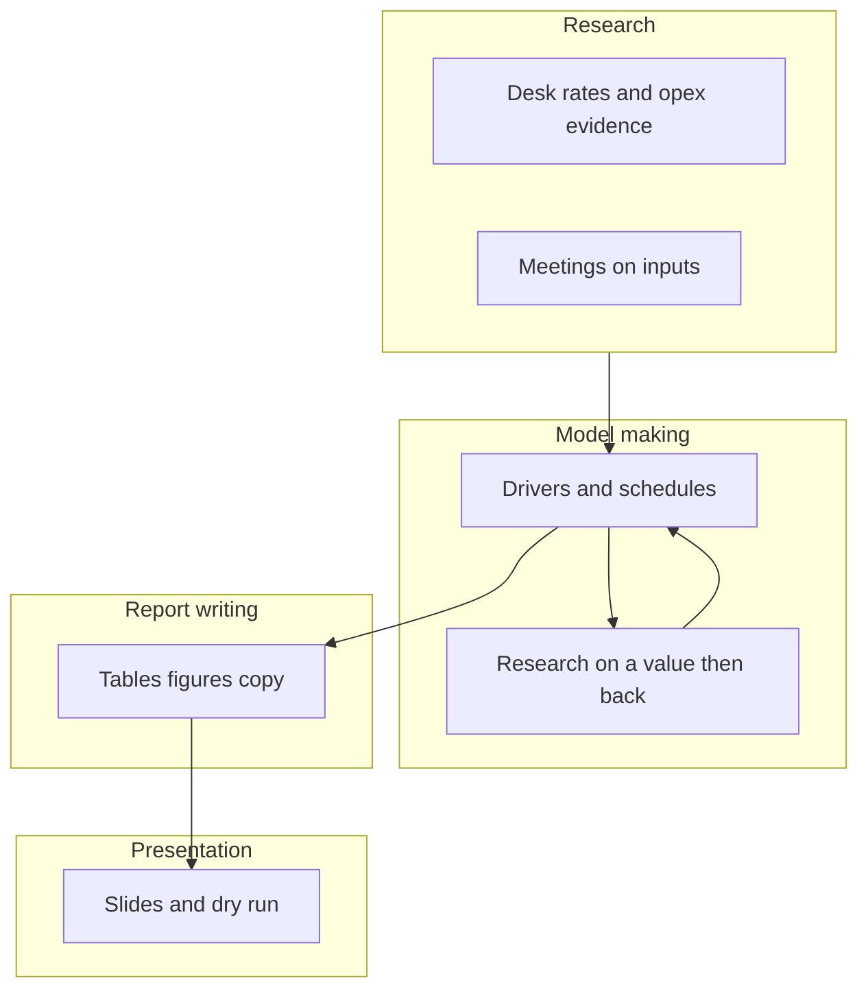

The function set (capex schedule, depreciation, opex, revenue, P&L, cash) follows the standard textbook ordering from Brealey, Myers and Allen. Capex feeds depreciation; depreciation and fixed opex feed P&L; net profit plus depreciation minus capex feeds the cash bridge. Keeping the function order honest to the textbook ordering meant I would not later find myself reaching backward in the pipeline to fix a downstream number. This took some time and there were some issues that needed catching and fixing when I next picked up.

4th December 2025
Option pool

"Gompers and Lerner's The Venture Capital Cycle" mentioned the idea of an employee option pool: shares the company reserves up front so it can grant equity to employees over time.

To check viability, I did some hand calcs starting with the funding rounds: £1M seed on a £4M valuation and £1.5M Series A on a £6M valuation. At each stage we leverage 20% equity stake, so founder ownership goes from 100% to ~80% post-seed to ~64% post-Series-A. I then added a 10% employee option pool. Founder stake falls from ~64% to ~58%. I ultimately decided against an option pool because substituting parts of salaries with equity does not massively benefit the company given salaries are a fairly small part of the picture. It also introduces uncertainties as we cannot be sure how many employees will accept share substitutions for cash. Ultimately it is not hugely important and intruduces  uncertainty and suggest unrealistic preceision.

6th December 2025
Debugging

When I filled the opex table, pandas warned I might be writing to a copy instead of the real table. I rewrote the updates so each change targets the correct row and column directly (using .loc), so when I change one input the opex numbers update the same way every time.

After the indexing fix I ran a change-param test: change one opex line item by £1k, regenerate, and confirm only opex-derived tables move. The model held up.

9th December 2025
Driver outputs contract

Before I expanded the model any further, I decided how the model would feed the report: the spreadsheet side should refresh the graphs, the tables in LaTeX, and any number mentioned in the text, so I was not copying figures by hand each time I wanted to change a value. I also ensured a mistake shows up as a clear failure instead of a silent wrong number so there are no inconsistencies in the final report.

11th December 2025
Capex schedule logic on paper

Traced vehicle purchases on paper year by year (first vehicle and setup in year one, extra vehicles when the fleet steps) so the pandas capex vector aligns with what Paul and I had decided in November. Each year's spend is depreciated over five years, research has shown that this is the easiest way to compare year on year growth of the business rather than having random spikes in cashflow.

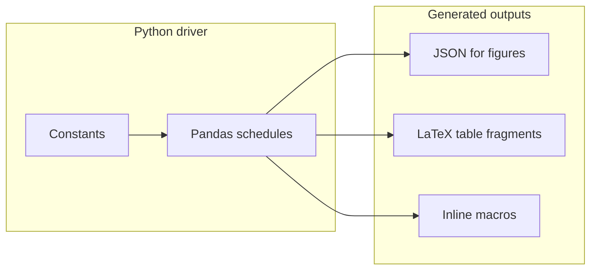

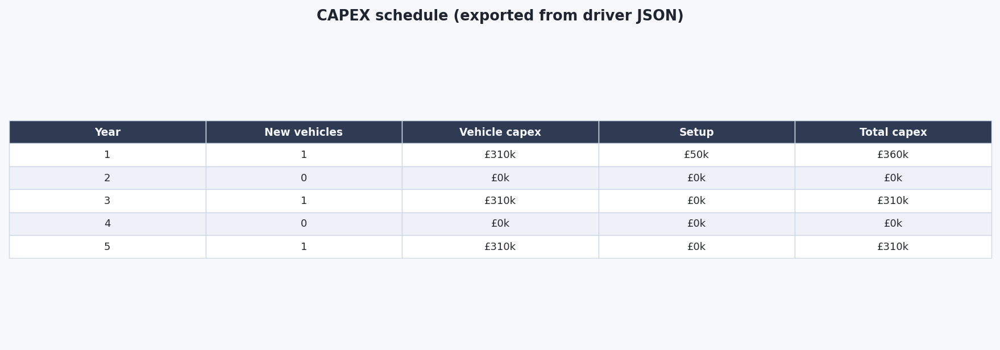

13th December 2025
Year-one fixed opex build

Broke down the year one fixed opex part by part. The OPEX vs CAPEX boundary came out of Brealey, Myers and Allen's chapter on operating versus investing cash flows, with the practical test that anything consumed in the year (salaries, rent, insurance, retainers) sits in OPEX and anything that creates a multi-year asset (vehicles, workshop fit out) sits in CAPEX. Started with personnel, listing each role we assumed we needed (CEO, ops lead, two test engineers, one data and software engineer, 0.3 FTE admin), then layered rent, insurance, certification, marketing, IT hosting, the vehicle maintenance retainer, and legal and audit on top. Once the line-item set was settled I moved on to researching defensible numbers for each.

18th December 2025
HMRC mileage rates

Given our TaaS structure and the fact that we will be transporting our cars to the customer, I read the full HMRC business mileage guidance and using it as a guidance to see how this transportation our variable cost per day. Approved mileage allowance payments are 45p per mile on the first 10,000 business miles in a tax year, then 25p per mile thereafter. Initial hand calc: assuming 50 to 80 sold test days per year for a single vehicle in early years and a round trip of approx 200 miles, that is 10,000 to 16,000 business miles. We will use the 45p rate throughout because the marginal effect of the threshold is small at our forecasted volume and using the higher rate is conservative. This is not entirely negligable and will be included in the model. 

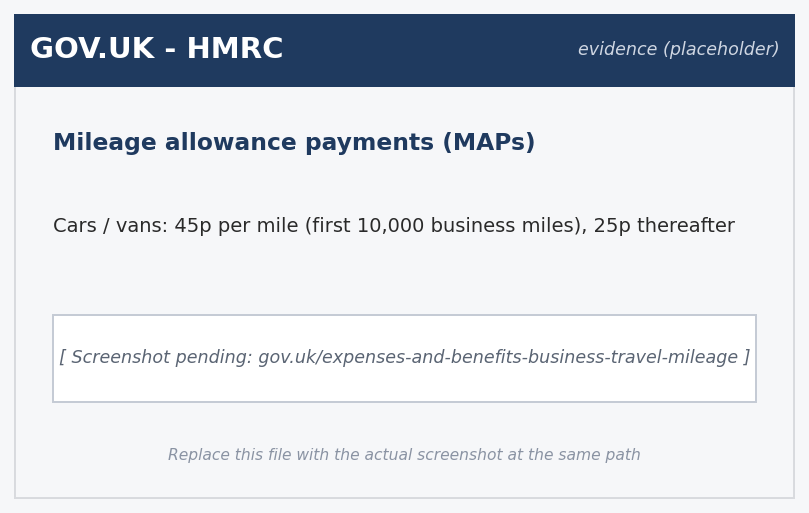

27th December 2025
Inflation assumption

Based the inflation assumption on the ONS Consumer Prices Index Including Owner Occupiers' Housing Costs (CPIH) series, sampling the 2023 to 2025 trend rather than the post pandemic spike years so the model reflects a more realistic value. That gave a rounded 3 per cent annual step which I applied both to fixed opex and to variable cost per day, however I made sure to caveat this saying the real world value could diverge.

I tested a model of year-on-year opex with and without the 3% step to see how the curve changes. The opex growth looked mostly due to hiring and fleet scaling, which matches what we would assume and predict and is a much more important part of the business plan and story.

5th January 2026
Discount rate, WACC versus Gompers hurdle

Read more about WACC, weighted average cost of capital, calculated from cost of debt, cost of equity and the debt-equity weights. For a pre-revenue company with no debt and no listed comparable that has the same risk profile, every input into WACC is essentially a guess. Even Brealey acknowledges WACC is hard to apply rigorously for venture stage companies.

As such I prefer the Gompers and Lerner VC hurdle approach, which uses the actual return targets that venture funds price equivalent investments at. For early stage UK ventures this sits around 20% as a central rate and 25 to 30% for the higher risk slice. The number is grounded in what an investor will actually demand for a deal at our profile. 

8th January 2026
Bridge round sizing first pass

Spent more time assessing the end-Y2 low cash balance (~£90K) I had been worrying about. Ideally a bridge round so that we can survive 6 months of burn so the company can survive a delayed Series A without renegotiating from a position of weakness. Six months of Y2 burn is roughly £200k. That number should be within the range that seed investors will typically pre-authorise as bridge facility in the seed term sheet, especially if the conversion terms (valuation cap and discount) are agreed up front. This is not crucial to the model however and is more of a piece of information to inform initial business negotiations with the seed round funders. 

12th January 2026
Customer concentration risk

The business plan that our financial model has to reflect has a customer concentration risk for Y1. Plan is 40 sold test days in Y1 against an early pilot customer profile of around 8 to 15 days per customer. If the largest customer takes 15 days, that is 38 per cent of Y1 revenue from a single customer. Above the 30 per cent threshold that most venture investors treat as a red flag according to https://exitreadyadvisors.com/resources/articles/customer-concentration-a-framework-for-understanding-exit-valuation-risk/, and worth researching further. 

A common risk mitigation Series A trigger as requiring two retainer conversions rather than one, so that the Series A is not raised at a moment when one customer represents the bulk of the revenue. 

15th January 2026
Revenue table and SOM penetration check

Built the revenue table from the model with sold days times blended rate against the headline revenue row for each year. I discussed the five-year sold-days row with Toby so he can confirm that the increase in sold days is realistic given his market research. Toby's SOM was about $26M in his market chapter. Our Y5 plan of £2.1M revenue is roughly 10 to 14 per cent of that (the band reflects the GBP to USD rate used at the time), which I kept in the low double digits deliberately so the chapter reads as a slice of SOM rather than a claim of total market capture. If Toby revises the SOM number this row of the chapter has to move with it, so I noted the dependency in a one-line note at the top of the relevant script.

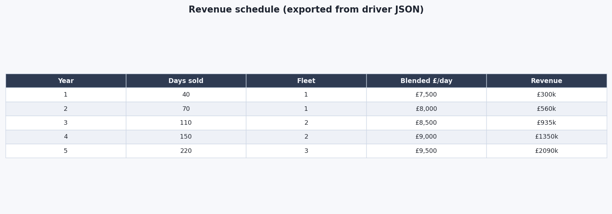

17th January 2026
Depreciation rule

Picked five-year straight-line depreciation on capex with zero residual at year five because it is easy to explain and reproduce, and it matches our bespoke test asset story. The treatment is consistent with the depreciation method described in Brealey, Myers and Allen.

Checked depreciation expense against capex spend manually for year one to confirm the model, and also confirmed zero residual meaning the asset is worth £0 by year five, matching the "no invented resale" story.

20th January 2026
Opex fix and variable cost calculator

When I regenerated opex, year 2 seemed too high. Investigating showed I had mixed year indexing (1-5 in one dict and a loop that still thought 0-4 in places). I fixed the mapping so each headcount step cost lands in the same calendar year as the hiring story, regenerated the tables, and confirmed the calculations by hand.

Then built the variable cost per day model. I started by listing all the constituent parameters: tyres and consumables, transport, crew travel and subsistence, and a wear allowance, increasing it slightly each year with the same inflation rule as fixed opex. I conducted research to find the best estimates for these values. The chapter uses £2,300 variable cost per test-day in Y1, split £800 / £600 / £400 / £500 as below. The research breakdown:

- Tyres and consumables (£800/day): priced high-duty track items (tyre sets, brake friction, fluids, filters) through motorsport and commercial parts channels, then stress-tested the bundle against an aggressive "multiple heat cycles + repeated braking" profile so the day-rate was not assuming road-car wear.
- Transport (£600/day): built from depot-to-proving-ground mileage (consistent with UK testbed use such as UTAC proving-ground hire cited in the chapter), fuel for a laden van and trailer, tolls where relevant, and a recovery-move contingency. Sanity-checked against HMRC's approved mileage allowance payments for business travel in cars and vans (45p/mile on the first 10,000 business miles in the tax year, 25p/mile thereafter).
- Crew travel and subsistence (£400/day): researched published rail/air fare bands for typical UK inter-city legs, overnight accommodation bands near major test corridors, and HMRC benchmark meal scale rates for qualifying long workdays (the published £5 / £10 / £25 caps are a useful tax-sensible floor, even though the model is not a payroll engine).
- Amortised vehicle wear (£500/day): kept separate from the fixed maintenance retainer in opex. This line captures faster-than-depreciation wear on sacrificial / high-wear items and trackside incident risk in a retained-asset PSS story, anchored so the four buckets sum to the headline £2.3k in the chapter and driver (`VARIABLE_COST_PER_DAY`).
- Inflation / path: the chapter motivates a rounded ~3% view using UK CPIH (ONS consumer price indices). In the published Python driver the £/day path is explicit annual steps (£2,350 → £2,500 by Y5), a simple auditable proxy rather than compounding every sub-line.

Sources I kept to hand for citations: ONS CPIH consumer price indices, HMRC business travel mileage and benchmark subsistence (EIM manuals where relevant), plus UTAC as already cited for facility-led benchmarking.

27th January 2026
First full P&L and EBITDA wording risk

Generated the first full five-year P&L from the model including depreciation and corporation tax from year four at the small-profits rate used by the government. EBITDA turns positive before net profit because depreciation is heavy in a capex-owned fleet model.

The tax rate came out of the HMRC Corporation Tax rates 2025 to 2026 page. Profits under £50k sit at the 19 per cent small profits rate, profits over £250k sit at the 25 per cent main rate, and there is a marginal relief band in between. Our Y4 EBIT lands well below the £50k floor on the small profits rate and Y5 sits in the marginal band, but I chose to model 19 per cent flat from Y4 rather than the stepped rate. The simplification is honest about the level of precision the rest of the model can support and avoids implying the tax line is more accurate than the underlying revenue forecast.

Drafted the tax paragraph immediately after the P&L script ran as it was crucial not to forget it, especially given we are profitable in years 4 and 5.

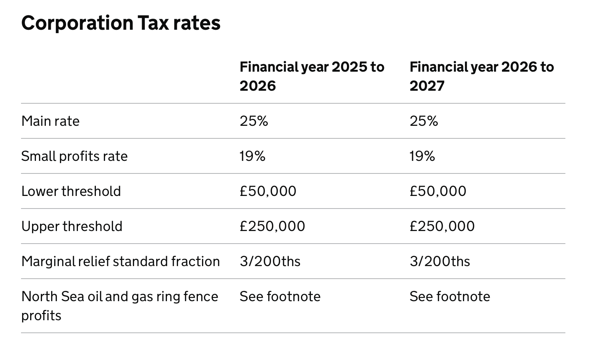

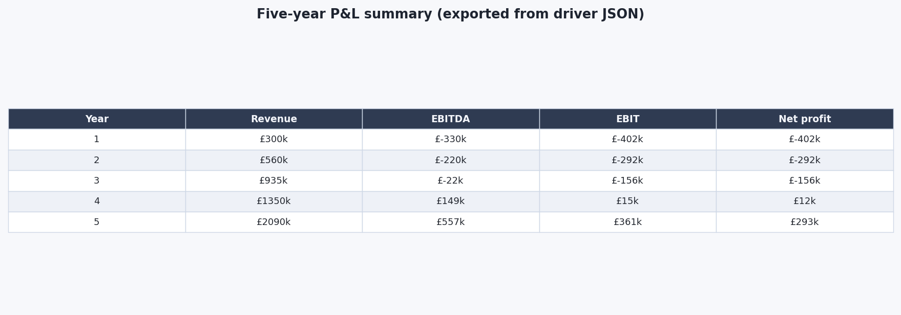

28th January 2026
Marginal relief tax check

The HMRC corporation tax marginal relief band sits between £50k and £250k of taxable profit. Our Y5 EBIT of around £370k falls just above the £250k upper bound so technically attracts the 25 per cent main rate, but Y4 EBIT of around £40k falls below the £50k lower bound so attracts the 19 per cent small profits rate. I easily hardcoded these values into the code however it is important to note that I have not created a clever banding structure that goes beyond this if we are repurposing the model for future years with much higher revenue. 

31st January 2026
Cash bridge, equity rounds, and the year-two hole

Started building the cash flow part of the model. Once the five-year cash bridge was modelled properly, I decided the funding need would be split into two equity moments, seed in year one and Series A in year three in the published table. The tightest point was end of year two, where cumulative cash falls to about £90k after two years of operating. Given this, I have scheduled future research on bridging rounds as it is possible that unmodelled elements may reduce this margin. I also drafted cash-risk bullet points for later prose: delayed Series A against a thin buffer, insurance premium step-up after a reportable incident, and early revenue concentration if one pilot customer has to convert into two retainers before the raise.

2nd February 2026
Free cash flow definition

The FCF definition follows Brealey, Myers and Allen's free cash flow chapter: free cash flow is operating cash flow minus capex, taken pre-equity so the seed and Series A rounds are not double-counted against the FCF row when the same series feeds NPV. Operating cash flow is net profit plus depreciation (as we count capex explicitly, we add depreciation as to not double count), and corporation tax applies from year 4.

Checked one year by hand against the cash bridge to confirm the FCF row matches the underlying cash figure exactly. Ensuring the model is robust and correct matters because the NPV/IRR work later will use this same model.

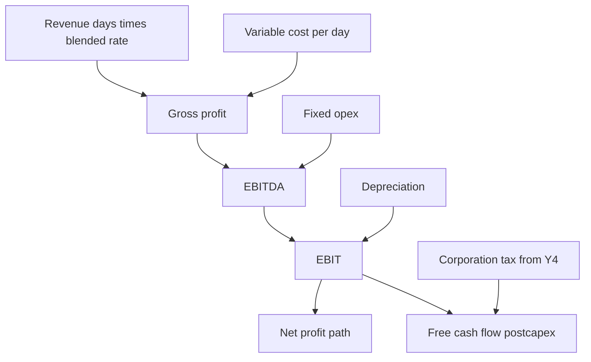

3rd February 2026
CAPEX inversion

Drafted the inversion figure with cumulative revenue versus cumulative capex. The point of the plot is to show the period where we are still spending on the fleet faster than cumulative revenue catches up. It is important however to show that this is not the same as profitability.

5th February 2026
Bridge financing

Follow-up to the ~£90k end-Y2 cash trough. I went to Gompers and Lerner's "The Venture Capital Cycle" on between-round financing, which describes the typical bridge as a short instrument sized at 6 to 9 months of burn rather than a full round, with pricing deferred to the priced Series A through a valuation cap and discount. I wanted a short list of unmodelled cash leaks to stress later (customer payment lag, retainer billing cadence, VAT/corporation tax timing if we ever tighten the cash tax logic, one-off legal spend around the raise).

7th February 2026
Break-even point

Coded break-even annual test days as (fixed opex plus depreciation) divided by (blended day rate minus variable cost per day) using the year-two cost base we had settled on. I also confirmed the calculation with pen and paper for one year. This element was inserted into the initial latex file which will update live as the model is changed. The latex file currently just contains the model charts and figures; the actual writing of the report is something I will start soon.

10th February 2026
Break-even chart

Plotted EBIT against a sweep of annual test days and overlaid the planned utilisation trajectory. The chart is mainly to see how the early years sit under break-even by the design of a TaaS business and the later years clear it. I annotated the break-even plot with the actual planned utilisation markers from Toby's discussion so I can see the distance-to-break-even visually rather than only in a table.

14th February 2026
NPV, IRR, terminal value

Implemented project NPV calculations into the model. Went back to Brealey, Myers and Allen for the NPV and IRR mechanics, and to Damodaran's "Investment Valuation" for the terminal value treatment and the framing of exit multiples in a thin comparables set. With those two textbooks I used a variable discount rate and cashflow values from the previous model to create an NPV curve to show how NPV changes with discount rate and also calculate IRR (the discount rate at which NPV hits 0). Checked the Y5 discount factor by hand against a Damodaran worked example to confirm the terminal value is discounted at the same horizon as the final operating cash flow. Currently neither the exit multiple or discount rate is finalised and subject to more research.

16th February 2026
Comparable multiples table

Pulled EV/Revenue multiples for the three closest listed or quasi-listed peers: AB Dynamics (LSE: ABDP) from their 2024 Annual Report and Accounts at 3.5×, Spirent Communications (LSE: SPT) from their investor page at 2.2×, and AVL List as a private comparable via a Refinitiv estimate at 1.8×. The peer group median is 2.5×, which applied to our Y5 revenue of £2.1M gives an indicative terminal value of £5.2M. The chapter uses the median rather than the AB Dynamics ceiling so the headline number does not get pulled by the largest comparable.

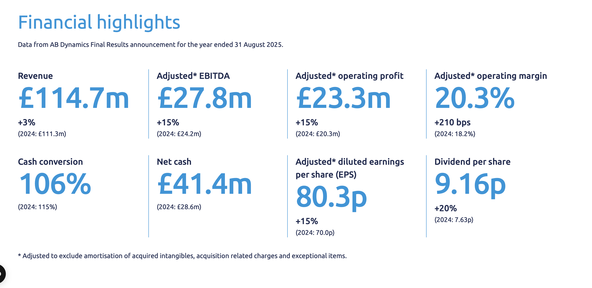

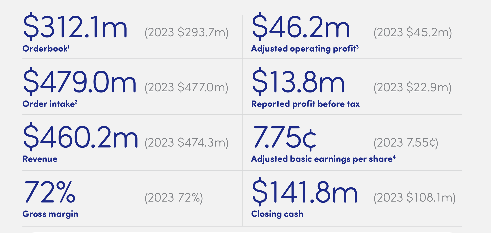

17th February 2026
Discount rates and hurdle language

The 20 per cent VC central and 25 per cent high hurdle points came out of Gompers and Lerner's "The Venture Capital Cycle" on typical fund target returns. I finalised a VC-style 20% hurdle and a harsher 25% point on the NPV curve. The reason is practical; I wanted a "high hurdle" to reflect a slightly pessimistic outlook capturing the risk and uncertainty that is high in a business with a large upfront CAPEX which takes 4 years to become profitable. I then wrote the terminal value paragraph.

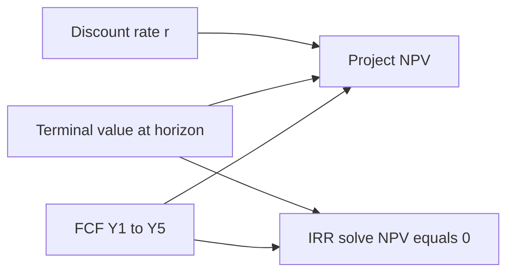

Built the NPV model off the same free cash flow series as the cash figure, added a terminal value at 2.5× year-five revenue from the peer median, and solved IRR as the rate that zeroes NPV. A key point dropped out of the model: most of the NPV is present value of terminal value, so the headline investability lives or dies on the multiple story and exit credibility, not on the early-year operating cash.

I kept the hurdle grounded in what VC readers expect rather than in fake precision. The 20% value, though high, is further justified by our very heavy weighting of terminal value in our NPV which adds to the risk.

I have now completed all the fundamental key aspects of the financial model. The core stack is: utilisation and fleet sizing; blended day-rate path; variable cost per day (with the published £/day trajectory); fixed opex (Y1 baseline, headcount step costs, inflation); capex and straight-line depreciation; five-year P&L through corporation tax; cash flow with seed and Series A; break-even days on the agreed year-two cost base; NPV, IRR, and terminal value; and funding triggers.

The model has revealed a few key features of the business: cash dominates the early story with the first few years having deeply negative cash flow even when the operating idea is sound; utilisation and fleet are the main revenue levers, so small changes in sold test-days move the whole bridge; profitability lags positive EBITDA because straight-line depreciation on owned vehicles is heavy; there are tax implications once EBIT turns sustainably positive; and the end-Y2 cumulative cash trough (~£90k) makes Series A timing a first-class risk. Most importantly, the NPV is heavily dependent on exit value so survival to Y5 is crucial. As such, it is prudent to perform sensitivity analysis to determine what the biggest threats are.

24th February 2026
Tornado sensitivity

Set up one-at-a-time shocks of ±20% on commercial and cost drivers and a wider band on inflation, then ranked the resulting year-three EBIT swings. Day rate and utilisation came out top: management attention on commercial levers beats cost-cutting at this scale.

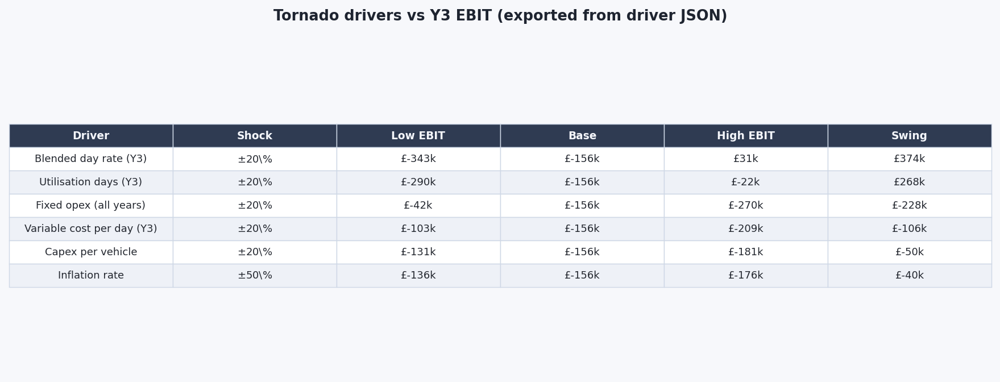

28th February 2026
Downtime assumption tied to strategy text

Re-read the strategy section on fleet recovery and downtime assumptions. In the model I treat downtime as a straight reduction in billable sold days while fixed opex stays paid, which is realistic for TaaS: if the car does not run you still burn payroll. That links maintenance execution directly to lost gross profit.

I started planning the downtime analysis model as a short pseudo-equation in notes: billable days equals planned days times one minus downtime rate, holding fixed opex.

3rd March 2026
Downtime figures and NPV versus EBIT timing

Plotted NPV at 20% against downtime and overlaid year-three and year-five EBIT on the same shock, and pulled in the downtime sensitivity table from the same driver run so the report, table, and figure agree. The point for writing is that EBIT goes negative at a lower downtime level than NPV because terminal value cushions the tail in the base case. I also noted in draft comments that if downtime also crushed the exit multiple we would be double-hit, even though the base model does not auto-link those.

7th March 2026
Funding section: seed, Series A, triggers

Locked seed and Series A sizes.

Went back to Gompers and Lerner on revenue based versus runway based round triggers, and noted that the venture default is a revenue trigger ("hit ARR X and Y named customers") rather than a runway trigger ("raise before cash runs out") because the latter signals weakness to the lead investor. I wrote our Series A trigger to match that pattern: at least £400k ARR and at least two retainer customers, with the timing window targeted at Q4-Y2 so the close lands before the £90k end Y2 cash trough rather than after it. Also checked that the £1.0M seed use of funds aligns with the loss profile in the P&L, giving roughly 18 months of runway through Y1 and into Y2.

10th March 2026
Unit economics box

After further research, I realised that unit economics will play a vital role in the financial story of the business. I therefore added LTV, CAC, and payback elements to the model. The research started with how VC readers expect those numbers framed (notably the Gompers et al. survey on how venture investors actually decide) and how SaaS-style heuristics translate to a PSS / TaaS model where customers buy days rather than seats. From that, I fixed the four inputs the formulae need: average annual revenue per customer, expected customer lifetime in years, contract gross margin, and customer acquisition cost (CAC).

Average annual revenue per customer ≈ £60k: estimated as ~8 test days × £7.5k blended day-rate, anchored to Toby's pipeline conversations and the early-customer profile we had been describing (one programme, a handful of validation days per year).

Customer lifetime ≈ 3 years: a deliberately cautious guess for an AV-testing engagement; long enough to reflect a multi-iteration validation cycle, short enough to avoid LTV inflation. Flagged in the chapter as illustrative.

Contract gross margin ≈ 70%: revenue-weighted, taken from our own variable-cost stack (£2.3 to 2.5k variable cost per day against a £7.5 to 9.5k day-rate) rather than from a third-party benchmark.

CAC ≈ £12k: built bottom-up from a realistic Y1 to Y2 commercial budget (conference attendance, outbound BD time, demo days) divided by the customer count those activities would credibly land.

That gives LTV = (8 × £7.5k) × 3 × 0.70 = £126k, LTV/CAC ≈ 10.5×, and payback ≈ 3.4 months, all sitting comfortably above the 3× LTV/CAC rule of thumb. I stress-tested by doubling CAC to see whether the qualitative claim survives and it does, so I kept the box as illustrative without pretending we have real pipeline data.

14th March 2026
Drafting scope and methodology in LaTeX

Before any writing I planned the chapter end-to-end on paper, matching the order the chapter eventually uses: scope and methodology; CAPEX; OPEX; revenue model; CAPEX inversion timeline; five-year P&L; five-year cash flow; break-even; NPV and IRR with terminal value; sensitivity; downtime financial risk; cash-headroom; funding strategy and use of funds; valuation by comparable multiples; conclusions and KPIs.

Scope first so the reader is told what we are doing and where Paul's engineering numbers enter capex; cost stack before revenue so the CAPEX inversion timeline has both cumulative lines available to plot; P&L before cash so net profit feeds the bridge cleanly. On top of the core list I pencilled a few potential add-ons that felt important on the day: a full cap-table and dilution waterfall to dress up the funding section, a stepped employer-NIC payroll model to back the salary line, and a working-capital / receivables schedule to make the cash bridge less abstract. Started drafting scope first, and from day one I wired every inline number to a generated macro so any figure quoted in the write-up has a single source in the driver.

17th March 2026
Drafting cost structure and revenue sections

Wrote the capex, opex, and revenue subsections of the chapter in that order, around the generated tables and the two donut figures (capex donut, opex donut). For capex I built the narrative around the £310k per-vehicle bucket plus £50k Y1 setup, with fleet timing wording (second vehicle Y3, third vehicle Y5) lifted directly off the capex schedule table so the timeline cannot drift from the cumulative-spend story used later in the CAPEX inversion figure. For opex I leaned on the Y1 fixed-opex donut to show the headcount-dominated stack and immediately attached one sentence about the 3% inflation rule and the headcount step costs so a marker is not left wondering why the column grows. For revenue I tied each number to the three driver arrays (sold test-days, fleet size, blended day-rate), referenced the Bronze/Silver/Gold tier pricing benchmarks from the November competitor work, and named the mix-shift explicitly so the rate path is not mistaken for unannounced price rises.

24th March 2026
Drafting capital budgeting: break-even, NPV, IRR, tornado

Drafted the break-even, NPV / IRR and sensitivity / tornado subsections in that order, and checked that the equation wording matches the code definitions line for line. Break-even is written as annual test days = (fixed opex + depreciation) / (blended day-rate - variable cost per day) on the Y2 cost base, with the chart overlaying the planned utilisation array so the marker can see distance-to-break-even visually rather than only in a table. NPV uses the same five-year free cash flow series that the cash figure plots, pre-equity and post-CAPEX, plus a terminal value at the Y5 horizon built from the peer EV/Revenue median (2.5× Y5 revenue), with 20% and 25% named as the central and harsher hurdle points. IRR is the discount rate where NPV crosses zero, calculated on the same series so a marker cannot accuse me of using one FCF definition for one number and a different one for the next. The tornado is one-at-a-time ±20% shocks on the headline drivers (utilisation, blended rate, variable cost per day, fixed opex), ±50% on inflation, with Y3 EBIT as the response variable, ranked largest swing to smallest.

28th March 2026
Financial risk: cash headroom write-up

Drafted the cash headroom section of the financial risk section, focused on the £90k end-Y2 buffer that the cash bridge identifies as the tightest point of the plan. The timing is that Series A preparation starts at Month 15 to target a Q4-Y2 close rather than a Y3 close, and that bridge round authorisation is pre-negotiated with the seed round so that a delayed Series A does not need to be re-negotiated under cash pressure.

I wrote three specific exposures into the same subsection. Series A timing is the headline risk because the buffer is only £90k. A reportable safety incident would compound it: insurance premiums on track work step up 2 to 5 times after an incident, which would move the insurance line from about £20k a year to £50k to £100k. Customer concentration is the third exposure: in Y1, more than 30 per cent of revenue is from a single pilot customer, so I wrote the Series A trigger to require two retainer conversions, not one, to reduce the risk revenue from just one customer would cause.

The tornado already shows that Y3 EBIT is brittle however the cash headroom subsection translates that into specific qualitative explanations that people can understand and act on, so a delayed round or an incident does not surprise the company into a forced bridge at a compressed valuation.

31st March 2026
Funding strategy and use of funds subsection

Wrote up the funding strategy as two equity rounds with explicit use of funds. Seed at incorporation: £1.0M, used for the Y1 vehicle build (£310k), the £50k workshop and data setup, and roughly 18 months of runway. Series A at Q4-Y2 / Q1-Y3: £1.5M, used for the second vehicle build, the Y3 to Y4 headcount additions (BD / Sales lead and second test engineer), and a further 18 months of runway. Indicative pre money valuations are £4M for seed and £6M for Series A, so each round is a 20 per cent equity issuance.

The Series A trigger is written as revenue based rather than runway based. The threshold is at least £400k ARR and at least two retainer customers. The point of pinning a revenue trigger rather than a runway trigger is that a runway trigger signals weakness to the lead investor: it tells them the company is raising because it has to, not because it is ready. The bridge fallback from the 5 February entry is the safety net if the trigger is missed by a quarter.

Checked with Toby that the £400k ARR threshold maps to a realistic Y2 pipeline conversion given his market sizing.

3rd April 2026
Valuation by comparable multiples subsection

Wrote the valuation subsection around the peer table built on 16 February. The three comparables and their EV/Revenue multiples are AB Dynamics (LSE: ABDP) at 3.5× from their 2024 Annual Report, Spirent Communications (LSE: SPT) at 2.2× from their investor page, and AVL List at 1.8× via a Refinitiv estimate. The chapter quotes the 2.5× peer group median as the headline multiple rather than the AB Dynamics ceiling, so the terminal value number does not lean on the single largest comparable.

Applied to our Y5 revenue of £2.1M the median gives a Y5 terminal value of £5.2M, and the AB Dynamics ceiling gives £7.3M. The subsection presents the £5.2M to £7.3M band rather than a single point, because a single point estimate would over-claim precision for an early stage exit that has not even been built yet.

7th April 2026
Unit economics box written into the chapter

Added the LTV, CAC and payback numbers from the 10 March model work into the funding section as a short equation block rather than a separate subsection. The four locked inputs are average annual revenue per customer of about £60k (about 8 test days at £7.5k blended), 3 year customer lifetime, 70% contract gross margin, and £12k CAC. That gives LTV of £126k, LTV/CAC of 10.5×, and payback of about 3.4 months, all comfortably above the 3× LTV/CAC rule of thumb cited via Gompers and Lerner's "The Venture Capital Cycle". I stress tested by doubling CAC to £24k and the qualitative claim still survives.

10th April 2026
Conclusions, recommendations and the eight KPIs

Drafted the conclusions block as a six recommendation list, each tied to a single Y1 action so the closing of the chapter reads as a board pack rather than a summary. The six in order: raise the £1.0M seed at incorporation and the £1.5M Series A at Q4-Y2 with bridge pre-auth in the seed term sheet; invest ahead of the maintenance protocol budget because a 10% systematic downtime costs about £390k of NPV against a £20k Y1 maintenance contract; pay the commercial team on blended day rate rather than bookings so the highest leverage driver from the tornado actually shows up in incentives; treat Y4+ revenue as conditional on CAM Testbed UK, CCAV and Thatcham relationships rather than as a given; protect the £90k Y2/Y3 cash boundary by targeting a Q4-Y2 Series A close rather than a Y3 close; and design the exit from day one because almost all of the NPV is terminal value.

I included the 8 most important KPIs: revenue, blended day rate, test days sold, gross margin, fixed opex burn and cash runway as the six operational drivers, plus incident free test days and unplanned fleet downtime as the two execution level signals that protect the downside case from the financial risk section. The split matters because the operational six are already projected in the model, and the extra two are what stop the model from quietly going wrong in the real world.

The closing sentence of the chapter names the single biggest threat to financial returns as the execution of the fleet recovery assumption.

14th April 2026
Deciding what to cut

The report being near 5 pages overlength, I had to review the whole report and cut or compress less relevant sections. I went back to the three potential add ons pencilled on 14 March and cut all of them, with one line reason each so the decision is logged honestly.

Cap table and dilution waterfall: cut. The seed and Series A subsections already name the indicative pre money valuations (£4M and £6M) and the 20 per cent dilution at each round. A full waterfall would let me draw a stacked bar chart of founder, employee pool, seed and Series A shares, but the underlying inputs (option pool size, anti dilution terms, lead investor pro rata) are all speculative at this stage and would over claim precision.

Stepped employer NIC payroll model: cut. The fixed opex stack uses a 20 per cent flat load for employer NI and benefits on top of the salary line, which is defensible because the headcount is small and the salary band is narrow. A stepped payroll model (thresholds, secondary contributions, employment allowance) would change the Y1 opex by less than £10k on a £538k base.

Working capital and receivables schedule: cut. The cash bridge is built on net profit plus depreciation minus capex, with no working capital line. Adding a receivables, payables and inventory schedule would let me model customer payment lag and would push the £90k end Y2 trough lower by a known amount. But the chapter already names customer payment lag as an unmodelled cash leak in the 5 February bridge financing entry, and an explicit schedule would imply a level of forecasting confidence we do not have at this stage.

Along with resizing a few graphs and removing tables which demonstrate the same data as the graphs, we had a comfortable 15 page pagecount.

25th April 2026
Term meeting: combined report merge

Full team sat down for a meeting on the combined report. The point was to merge the 10 chapters (5 engineering and 5 business) into one document, walk through the result end to end, and smooth over anything that read like three separate drafts stitched together.

We consolidated all the contents pages at the top and ordered all page numbers. We ensured consistency with formatting and notation such as referencing and labelling tables and graphs. We decided to reference at the end of each section rather than referencing all at the end for easier lookup.

We finally submitted the report for a first draft evaluation and are awaiting feedback we will action.

28th April 2026
Making the slides

I need to highlight only the key elements of my section of the report due to timing and slide limitations in the presentation. I compressed down to two business slides: a five year financial model slide that pulls the whole forecast into one image plus six KPI boxes, and a sensitivity analysis slide that pairs the tornado with the downtime curve.

The headline numbers I picked for the financial model slide are: £0.98M total CAPEX, £2.5M equity raised, 122 days/yr break-even, £1.32M project NPV at 20%, £5.2M indicative Y5 exit value, and £538k Y1 fixed OPEX. The assumptions strip at the foot of the slide carries the three driver paths (utilisation 40 to 220 d/yr, blended rate £7.5k to £9.5k/d, variable cost £2.3k to £2.5k/d) so the audience can see what the model is parameterised on without needing to refer to the report.

The sensitivity slide condenses the chapter's tornado and downtime work into a single page. Three takeaway boxes anchor it: 10 per cent downtime equals a £390k NPV hit (about 20 times the £20k Y1 maintenance line), Y1 maintenance is only ~£20k so it is not where the cost lever is, and reliability spend equals NPV protection as the executive summary. The two charts (Y3 EBIT tornado, Y3 / Y5 EBIT versus downtime) carry the data; the boxes carry the conclusion.

3rd May 2026
Collected all used references

Locked down references for the chapter: Brealey, Myers and Allen and Damodaran for the corporate finance and valuation framing; Gompers and Lerner for venture funding mechanics and round triggers; ONS CPIH for the inflation assumption; HMRC for corporation tax bands and travel and subsistence sanity checks; AB Dynamics, Spirent and AVL filings for the EV/Revenue comparables; UTAC, HORIBA MIRA and AB Dynamics facility pages for the day-rate band; archived investor pages as `@online` with access dates.

6th May 2026
Writing the script

I have a 2.5min max for the business side of the presentation. Wrote a script that told the overall financial story of the business with the slide that supported this; starting with the 5 year forecast graph then on to the sensitivity and downtime analysis. It was a bit too long and needs to be whittled down however as initial runs show a runtime of nearly 3.5mins.

9th May 2026
Solo practice and refinement

Practised the slides with a stopwatch and refined the script by removing filler and less relevant sentences. I also practiced the handovers which are integral to a smooth and professional presentation.

11th May 2026
First group runthrough

The whole team sat down for the first full runthrough of the combined deck. Each of us presented our own slides in order, with the others as audience and time keeper.

Overall the presentation dryruns went well with a few people going slightly over time and having to refine their scripts. The focus was largely on speaking without a script in front of you and refining the slide changes done for your teammates and transitions.

14th May 2026
Second runthrough

A second group runthrough was a great improvement. Everyone could present without a script or flashcards and transitions went smoothly. The order and slides were all finalised and we felt prepared for the final presentation.

ToDo: Final feedback round on combined report, polish presentation cues, fold any late SOM revision from Toby into the revenue table, and "*"s.
