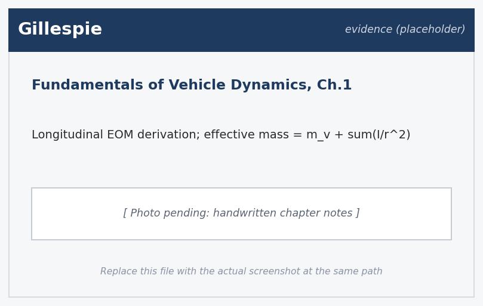
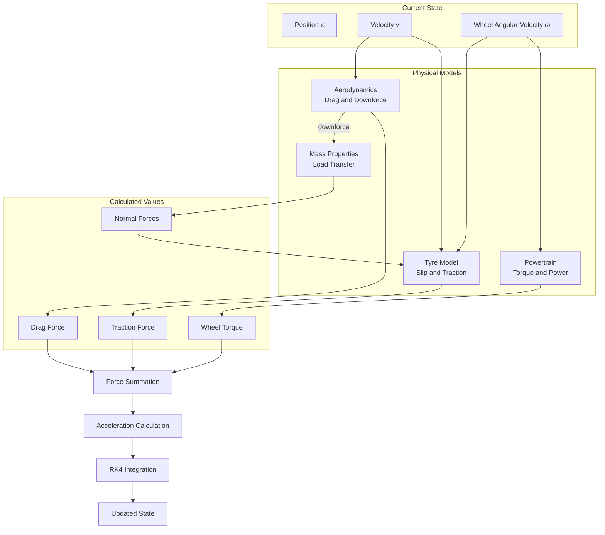
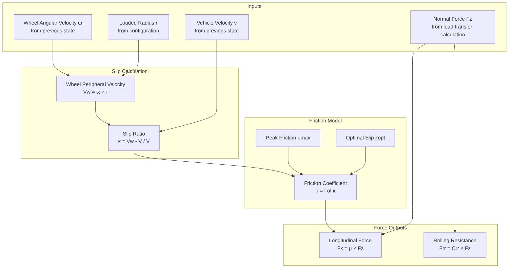
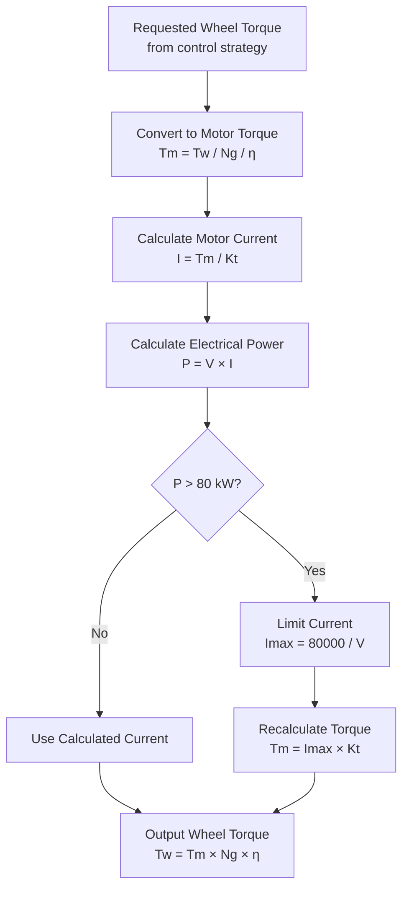
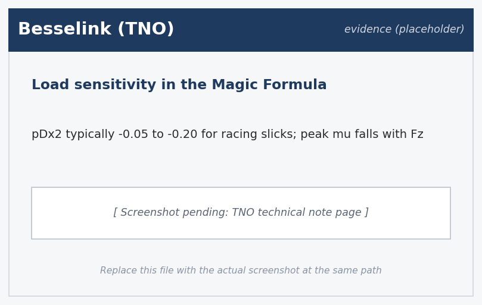
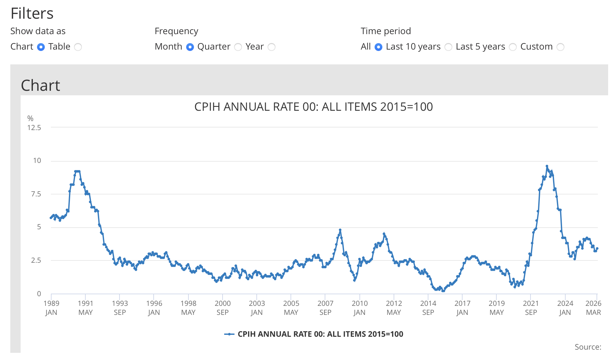

Formula Student Simulation Logbook - Harry Emes

4th November 2025
Rules Analysis and Scoring Formula

Began the project by downloading the Formula Student 2025 rulebook. We are tasked with the 75m acceleration event only. My role is to build and run simulations to predict how long our vehicle will take to complete this given its design parameters.

Reading through the rulebook, rule EV 2.2 specifies that power at the accumulator outlet must not exceed 80 kW. This is measured as the product of bus voltage and current draw from the battery pack, not mechanical power at the wheels. Drivetrain losses (motor inefficiency, transmission friction, bearing losses) mean that mechanical power delivered to the wheels will be lower than electrical power drawn from the accumulator, so I need to factor in overall drivetrain efficiency. 

The scoring formula is defined in section D 5.3.2:

M = 0.95 × Pmax × ((Tmax / Tteam - 1) / 0.5) + 0.05 × Pmax

where Tmax = 1.5 × Tfastest, Pmax is the maximum points available for the event (75 for acceleration), and Tteam is our recorded time. Any team exceeding Tmax recieves only the baseline 3.75 points. While the scoring matters, I think the clearer measure of progress will be the run time itself as the points depend heavily on times from other teams which we cant predict.

I read an overview of Gillespie's "Fundamentals of Vehicle Dynamics" and began some priliminary reading and started making notes on the main sections that are relevant **Insert table here.

5th November 2025
Rulebook section EV 2.2 deeper read

Read EV 2.2 80kW rule in more detail. The rule caps the rolling average power drawn at the accumulator outlet at 80 kW, measured over 500 ms. That averaging window matters because instantaneous overshoots are tolerated as long as the rolling average stays inside. Practically for our model it means a hard instantaneous cap is conservative and gives us a small margin; we should still ideally target a hard 80kW cap however it is important to note that we do not have more extreme measures to ensure that it stays under 80kW at all time. 

6th November 2025
First team meeting

Toby said he does not have a chassis CAD yet so I should expect rough estimates untill probably December. Paul is leaning towards a supercapacitor accumulator rather than a battery which is unusual and means I will need a proper energy storage model later, not just a constant voltage rail. Yuze wants the motor torque and current limits configurable as he is still picking between options. I can proceed with the build with estimated dummy parameters however I should first model whether a supercapacitor design is viable and feedback to Paul if not. ** Insert section about quick batt vs supercap check.

7th November 2025
Longitudinal Dynamics and Resistance Forces

Continued reading Gillespie. The fundamental longitudinal equation of motion for a vehicle accelerating in a straight line is:

Fnet = Fx,traction - Fx,drag - Fx,rolling

with net force producing acceleration by Newton's second law. However the effective mass is not just the vehicle mass. Rotating components (wheels, motor rotor, transmission elements) must also be angularly accelerated and this contributes an additional inertial term.

For a wheel with moment of inertia Iwheel and radius r, the equivalent translational mass is Iwheel/r². For four wheels the total is 4×Iwheel/r². With typical Formula Student values (Iwheel ≈ 0.10 kg·m², r ≈ 0.247 m), this adds approximately 6.5 kg to the effective mass. For a 250 kg vehicle that is a 3.3% increase in inertia which is small but non-negligable and cant be ignored.

The full equation becomes:

(mvehicle + 4×Iwheel/r²) × a = Fx,traction - Fx,drag - Fx,rolling

Aerodynamic drag follows the standard quadratic:

Fx,drag = 0.5 × ρ × Cd × A × v²

For a Formula Student vehicle without significant aero bodywork, CdA is typically 0.7 to 1.0 m². At 25 m/s (90 km/h, approximately terminal velocity over 75 m) and ρ = 1.225 kg/m³, drag is:

Fx,drag = 0.5 × 1.225 × 0.8 × 625 = 306 N

Small compared to the traction force available at launch (several thousand newtons).

Rolling resistance is proportional to normal load:

Fx,rolling = Crr × Fz,total

Crr for racing slicks on smooth asphalt is around 0.010 to 0.015 dry. For a 250 kg car that gives roughly 25 to 37 N. Small but not negligable over the run.

11th November 2025
Tyre Force Models and Slip Ratio

Tyre force generation today. The longitudinal force a tyre generates depends on two things, the normal load and the slip ratio between tyre and road.

Slip ratio is the normalised difference between the wheel's peripheral velocity and the vehicle's translational velocity:

κ = (ωr - v) / v

where ω is wheel angular velocity, r is loaded tyre radius, v is vehicle velocity. When rolling freely with no torque, κ = 0. During acceleration the driven wheels spin slightly faster than rolling alone would give, so κ > 0.

There is an optimum slip because both too little and too much cause issues. At zero slip there is no tractive force. As slip increases the friction coefficient rises approximately linearly untill a peak at the optimal slip ratio, typically 0.10 to 0.15 for dry racing tyres. Beyond that the coefficient falls off as the tyre starts spinning excessively.

The industry standard model is the Pacejka magic formula:

μ = D × sin(C × arctan(B×κ - E×(B×κ - arctan(B×κ))))

where D is peak friction, C is shape (about 1.65 for longitudinal), B is stiffness, E is curvature. These parameters are normally identified on a tyre rig. We are not running a rig programme for this project, so I planned to populate the full Magic Formula later from published Formula Student fits and community-shared coefficient sets on the FSAE forums.

I researched Pacejka coefficients and found the public Avon pages thin for a complete longitudinal fit. I applied to the FSAE forum where teams routinely post full parameter packs for common slicks.

In the meantime I will implement a simplified piecewise-linear model:

For κ ≤ κopt:   μ = μmax × (κ / κopt)
For κ > κopt:   μ = μmax × (1 - (κ - κopt) / (1 - κopt))

Two free parameters only, μmax (typically 1.2 to 1.5 for racing slicks) and κopt (typically 0.10 to 0.15). Traction force is then:

Fx = μ(κ) × Fz

The architecture keeps `tire_model_type` switchable so the simplified model stays available beside the full Pacejka once the coefficient set is in place.

14th November 2025
Numerical Integration

Started reading Press et al.'s "Numerical Recipes" through the online library. The simulation needs to advance position, velocity and wheel angular velocity forward in time by integrating a system of coupled ODEs.

The simplest method is Euler:

x(t + dt) = x(t) + f(x, t) × dt

I implemented Euler first as a quick sanity check. It runs however it is unstable when the forces change quickly which happens at launch and when the powertrain hits the 80 kW limit. Local truncation error is O(dt²), global is O(dt). For dt = 0.001 s over 5 seconds thats 5000 steps and errors accumulate noticeably.

4th-order Runge-Kutta is the standard upgrade:

k1 = f(x, t)
k2 = f(x + k1×dt/2, t + dt/2)
k3 = f(x + k2×dt/2, t + dt/2)
k4 = f(x + k3×dt, t + dt)
x(t + dt) = x(t) + (k1 + 2×k2 + 2×k3 + k4) × dt/6

Local error O(dt⁵), global O(dt⁴). Four derivative evaluations per step instead of one but the overhead is fine. I considered using scipy.integrate.solve_ivp instead however I want full control over what happens at each timestep (state logging, constraint checks, possible event handling) so I will write my own RK4.

18th November 2025
Software Architecture Design

Sat down and sketched the whole thing quickly in mermaid - this will need to be tidied up for the report. The simulation involves several physical models that interact every timestep and I want them in separate modules so they can be built and changed independantly.

Vehicle parameters will live in JSON config files rather than hardcoded values. This means parameter sweeps and optimisation later wont need code changes, and different configs can be compared easily. Originally I planned YAML however JSON is in the standard library and editor support is better.

The powertrain has to enforce the 80 kW limit at the accumulator outlet, not at the motor shaft or wheels. The logic is:

1. Calculate the requested motor torque from the control strategy
2. Determine motor current: I = Tmotor / Kt
3. Electrical power: P = Vbattery × I
4. If P > 80 kW, limit current to Ilimit = 80000 / Vbattery
5. Recalculate actual torque from limited current: Tactual = Ilimit × Kt
6. Convert to wheel torque: Twheel = Tactual × Ngear × ηdrivetrain

21st November 2025
Tyre Data Flow and Load Transfer

Before writing the tyre code I drew the force interactions and data flow for the driven rear wheels. Mermaid again for ease, but will need to be clearer for the real report. 

Fz on each axle is not constant during acceleration. Longitudinal load transfer shifts weight from front to rear as the car accelerates. The transfer depends on acceleration, CG height and wheelbase:

ΔFz = (m × a × hCG) / L

so the normal forces become:

Fz,front = Fz,front,static - ΔFz + Fdownforce,front
Fz,rear  = Fz,rear,static  + ΔFz + Fdownforce,rear

Quick hand-calculation for a 250 kg vehicle with 50/50 static distribution, 0.30 m CG height and 1.55 m wheelbase accelerating at 1g:

ΔFz = (250 × 9.81 × 0.30) / 1.55 = 475 N

So roughly 475 N moves from front to rear. The rear normal force goes from 1226 N (static) to 1701 N, front goes from 1226 N to 751 N. This benefits a rear-wheel-drive car by adding grip at the driven wheels however it also creates a feedback loop, more acceleration leads to more transfer leads to more grip leads to more acceleration. 

24th November 2025
Project Setup

Started writing code today. Installed numpy, scipy, matplotlib.

Created vehicle_config.py with dataclasses for each parameter group:

- MassProperties: mass, CG x and z, wheelbase, tracks, inertias
- TireProperties: loaded radius, peak μ, optimal slip, rolling resistance
- PowertrainProperties: motor Kt, max current, max speed, battery voltage, gear ratio, drivetrain efficiency, power limit
- AerodynamicsProperties: CdA, downforce coefficients front/rear
- ControlProperties: launch torque limit, target slip ratio for traction control

Added a validate() method on the main VehicleConfig to catch nonsense and to sense check (negative masses, gear ratios ≤ 0, μ outside 0 to 2 etc).

27th November 2025
Configuration Loader

Implemented load_config() to read the JSON file and constructs the dataclass instances. 

Made a base_vehicle.json with rough Formula Student numbers:

- Total mass: 250 kg (with driver)
- Wheelbase: 1.55 m
- CG height: 0.30 m
- Tyre radius: 0.247 m
- Peak μ: 1.4
- Motor Kt: 0.5 N·m/A
- Battery voltage: 400 V
- Gear ratio: 4.0
- CdA: 0.8 m²

These are estimates from published Formula Student data. Toby said he does not have chassis numbers yet so the mass, wheelbase and CG will move later.

29th November 2025 (Saturday)
Tyre Model and the Sign Error

Implemented calculate_longitudinal_force() in tire_model.py. Takes Fz, slip ratio and velocity, returns traction force and rolling resistance.

Note: Milliken uses a different sign convention causing a -ve issue 
Corrected error, had written:

κ = (v - ωr) / v

when for acceleration it should be:

κ = (ωr - v) / v

With the wrong formula accelerating wheels (ωr > v) give negative slip which gives negative μ which gives negative force.

After fixing this the model, I confirmed with hand calc: Fz = 1500 N, κ = 10% gives Fx ≈ 2100 N which is consistent with μ ≈ 1.4.

2nd December 2025
Mass Properties and Load Transfer

Static weight distribution by CG position:

Fz,rear,static = (m × g × LCG) / L
Fz,front,static = m × g - Fz,rear,static

For a CG at 0.775 m behind the front axle on a 1.55 m wheelbase, distribution is 50/50 however this subject to change depending on future optimisation script and discussion with Toby about Chassis design. 

Load transfer uses the formula derived earlier:

ΔFz = (m × a × hCG) / L

calculate_normal_forces() takes the current acceleration estimate, front downforce and rear downforce, returns the per-axle normal force. The acceleration estimate is from the previous timestep which is fine for small dt.

Wrote unit tests. 250 kg at rest = 1226.25 N each axle. Accelerating at 10 m/s² with hCG = 0.30 m and L = 1.55 m gives ΔFz = 484 N so rear = 1710 N, front = 742 N. The code matches.

4th December 2025
Motor rotor inertia check

Added the motor rotor inertia to the effective mass calculation. The motor rotor is small but spinning at gear-ratio times wheel angular velocity, so its reflected inertia is J_motor times Ngear squared. For our motor with J_motor around 0.02 kg·m² and Ngear = 4, the reflected inertia at the wheel is 0.32 kg·m², which divided by the wheel radius squared (0.247²) gives an effective translational mass of about 5.2 kg. Combined with the four wheel inertias the total rotating mass term is about 12 kg, or 6% of vehicle mass Small but not negligable.

8th December 2025
Tyre temperature literature scan

Read Hoover's thesis on tyre thermal modelling for FS. Ffor a 75 m acc run the bulk tyre temperature only swings by 10 to 15°C from cold tyre to peak, so a thermal model would change predicted time by a fraction of a percent if our cold temperature is already inside the working window. Not worth the modelling effort right now. Will revisit if we ever want to model multiple back-to-back runs on the same tyre set, in which case heat changes becomes meaningful.

9th December 2025
Aerodynamics

I am using a splified aerodynamics module to model a best case areodynmaic package to justify lack of front and rear wings which we anticipate are largely irrelevant for a 75m acc run. Confirmation is required however.  

Drag:

Fdrag = 0.5 × ρ × CdA × v²

ρ = 1.225 kg/m³ by default. Returns zero at zero velocity to avoid the v² term blowing up the gradient.

Downforce:

Fdownforce = 0.5 × ρ × CL × Aref × v²

Separate CL for front and rear so aero loading can be asymmetric. Most FS cars run more rear downforce for grip. I am including the aero package in the model however it is unlikely we will actually build one. The straight-line acceleration sims should show that wings are largely irrelevant here.

Drag is negligible at launch but starts to matter at higher speeds. At 25 m/s, drag uses about 7.6 kW of the 80 kW budget which is not nothing.

12th December 2025
Powertrain and Power Limiting

To confirm there is no major advantage to battery, I am modelling battery as well as supercaps to justify our usage (supercaps have other advantages such as weight, pricing, wear of parts etc.
powertrain.py models a simplified electric drivetrain, battery -> motor -> single-speed gearbox -> driven wheels. 

Key relationships:

Tmotor = Kt × Imotor
ωmotor = ωwheel × Ngear
Twheel = Tmotor × Ngear × ηdrivetrain
Pelec = Vbattery × Imotor

The 80 kW limit applies to Pelec at the accumulator outlet, not mechanical power. This is per the rules.

Initial implementation was wrong because I limited motor torque directly. Power is P = T × ω so the same torque at different speeds is different power. At low speed torque is limited by current, at high speed by power. The transition is at:

Tmax × ωmotor = 80000 W

For Kt = 0.5 N·m/A and Imax = 300 A, peak motor torque is 150 N·m. Power-limited regime starts at ωmotor = 80000 / 150 = 533 rad/s. With gear ratio 4 and r = 0.247 m thats about 33 m/s vehicle speed, which is beyond what we hit in 75 m, but the logic still has to be right.

15th December 2025
First Integration Attempt

Tried wiring all the modules together. SimulationState dataclass holds:

- time, position, velocity
- wheel_angular_velocity_rear, _front
- acceleration
- various forces for logging

solve() initialises at t=0 then steps untill position > 75 m or time > 25 s (rules disqualification threshold).

Per timestep:

1. Aerodynamic forces from current velocity
2. Estimate normal forces using previous acceleration
3. Calculate slip ratios
4. Tyre forces
5. Request torque from control
6. Actual torque and power from powertrain
7. Sum forces -> net force
8. Acceleration from net force / effective mass
9. Refine normal forces with actual acceleration
10. State derivatives
11. RK4 step
12. Store history

First run completed 75 m in 2.1 seconds. This is wayyy too fast, either the sim or some dummy values are very wrong. Will investigate fix when I next pick up. 

5th January 2026

The 2.1 second time from before Christmas is still the bug to find.

The force summation in solver.py had:

net_force = drive_force + drag_force + rolling_resistance

when it should be:

net_force = drive_force - drag_force - rolling_resistance

Drag and rolling resistance oppose motion; correcting the signs the time is now around 4.0 seconds which is in the right ballpark for a competitive Formula Student vehicle.

However the power log shows values exceeding 80 kW. The limiter is not doing its job, damn.

8th January 2026
Power Limit Variable Mixup, and Proper RK4

The power limit bug was a variable naming error. 

After the fix the power profile is what I expected. Power ramps up to 80 kW at about 0.3 s then stays flat as torque drops with speed. Launch is traction limited, then there is a transition, then it is power limited.

I also rewrote the RK4 integration properly. The previous version was reusing the same force calculation across the four k stages which is exactly what RK4 must not do. Each k1, k2, k3, k4 needs a full force evaluation at the intermediate state. Wrote helper functions _add_states() and _scale_state() so the RK4 update reads cleanly.

11th January 2026
Timestep convergence study

Now the sim runs cleanly end to end I want to confirm the 1 ms timestep is not throwing away accuracy. Ran the base config at dt = 0.5, 1, 2 and 5 ms and compared against the 0.5 ms reference:

- dt = 0.5 ms: 3.985 s (reference)
- dt = 1 ms:   3.984 s (delta 1 ms)
- dt = 2 ms:   3.981 s (delta 4 ms)
- dt = 5 ms:   3.962 s (delta 23 ms)

So 1 ms is comfortably below 0.1% error, which is well inside the noise from parameter uncertainty. 5 ms is starting to lose meaningful accuracy at the launch transient where things change quickly. This matches the Numerical Recipes stability check from 17 Nov which said 1 ms was an order of magnitude inside the stability region. Locking 1 ms as the default in base_vehicle.json.

13th January 2026
First Successful Run and Plots

Full simulation working end to end. Base vehicle does 75 m in 3.99 s, final velocity 26.7 m/s (96 km/h).

The acceleration profile has three phases:

1. Launch (0 to 0.3 s): traction limited, a ≈ 11.8 m/s²
2. Transition (0.3 to 0.5 s): power limit hit, a decreasing
3. Power limited (0.5 s onwards): a decreases roughly inversely with v as constant power gives less force at higher speed

Compared to a constant-acceleration model with the same average, the actual profile starts higher then drops. It crosses the constant line around 2 s and 40 m. Final time is about 0.2 s longer than the constant-acceleration equivalent which is the cost of being power limited for so much of the run.

20th January 2026
Wheelie Detection

Found another edge case during parameter sweeps. With higher torque configs the front normal force was coming out negative which is impossible. A negative front normal force means the front wheels would lift, ie the car wheelies.

Negative front Fz happens when:

ΔFz > Fz,front,static

ie

a > (Fz,front,static × L) / (m × hCG)

For the base car with 50/50 distribution, 1.55 m wheelbase, 250 kg, 0.30 m CG:

a > (1226 × 1.55) / (250 × 0.30) = 25.3 m/s²

which is way more than the car can actually do (peak is ~11.8 m/s²), so the base config is safe. However a lighter car or higher CG could wheelie at launch and we need to catch this if it happens.

Added check_wheelie() in rules/. Iterates through state history, flags violations and records the first wheelie time.

27th January 2026
Pacejka Research

Given that approx half the run seems to be tracktion limited, I feel that the piecewise model needs to be upgraded for an accurate model. The simplified piecewise model was good enough to get the solver stable but I want a proper Pacejka model for the writeup and for the energy storage analysis later, where load sensitivity will matter more.

I researched Pacejka coefficients again: the public Avon material was still not enough for a self-contained longitudinal Magic Formula on its own. I had already applied to the FSAE forum to harvest archived fits, load-sensitivity terms, and the usual student-team spreadsheet dumps so every term in the longitudinal branch could be specified without hand-waving.

In the meantime I read more about the Magic Formula. The shape factor C is around 1.65 for longitudinal force, the peak D is approximately μmax × Fz, B is the slope at the origin (which controls the initial stiffness) and E is a curvature term. Load sensitivity is usually included by making D depend on Fz:

D = Fz × (pDx1 + pDx2 × dfz)

where dfz = (Fz - Fz0) / Fz0 is the normalised load deviation from a nominal value. This is important for us because the rear axle takes a lot of load transfer at launch and a load-insensitive peak μ overstates grip noticeably in that condition.

Wrote a PacejkaCoefficients dataclass keyed to Pacejka notation with textbook placeholders only where the forum had not yet filled the sheet. The intent was to paste in the full numeric set as soon as access came through.

29th January 2026
Forum acceptance

The FSAE forum accepted my application and I now have access to the tyre modelling sections. Over a couple of evenings I pulled together everything the longitudinal branch needed: archived Fx fits and Magic Formula spreadsheets for the same slick family we run, load-sensitivity terms teams actually sign off in design review, and worked examples of the stiffness and curvature blocks.

By the end of the day I had a complete coefficient set for the sim (all the pDx / pKx pieces, C, E, and the nominal load anchor). The Pacejka branch is structurally correct and now numerically specified for this project. 

2nd February 2026
Pacejka Implementation

Implemented the Pacejka branch in tire_model.py alongside the simple model. Selected by tire_model_type in the config, "simple" or "pacejka". Default is now pacejka because the simple model overstates grip at high load.

Did a quick comparison plot, simple vs pacejka at nominal load and across the load range we actually see during acceleration:

At Fz = 1500 N the two models agree near the peak which is fine, but at higher loads (the rear during launch reaches 2500 N or more) the pacejka peak is noticeably lower. The simple model is optimistic by maybe 5 to 8% in those conditions.

The coefficients in the repo are pDx1 = 1.7, pDx2 = -0.12, pKx1 = 35000, pKx2 = -3000, C = 1.65, E = 0.1. The negative pDx2 captures load sensitivity (μ decreases as load goes up). These are the consolidated forum- and datasheet-backed values from 29 Jan, not placeholder guesses.

4th February 2026
Deeper Pacejka research

The pDx2 term that captures load sensitivity is typically negative for racing slicks (the peak friction coefficient falls as normal load rises), and the magnitude is usually in the range -0.05 to -0.20. Our forum-derived pDx2 of -0.12 sits comfortably in the middle of that band.

Besselink also covers the physical reason: at higher normal loads the contact patch deforms more and the rubber operates further from its optimal compression. The effect is more pronounced on cold tyres. For us the immediate consequence is that the rear axle under launch load transfer (peak Fz around 2500 N versus nominal 1500 N) gets a meaningful peak friction reduction, which the Pacejka branch captures correctly and the simple model does not.

5th February 2026
Talking to Paul About the Accumulator

Sat down with Paul to talk about his accumulator. He has a MATLAB script main.m for the supercapacitor discharge. The idea is a series stack of supercap cells (he is leaning towards 200 cells of a 3.0 V cell, giving 600 V nominal) with capacitance and equivalent series resistance per cell. As energy comes out the bus voltage sags.

A battery model has near-constant voltage over a short event. A supercap does not. For our 75 m acceleration we discharge a meaningful fraction of the stack and the voltage drops by over 100 V across the run. That matters for power delivery because the inverter and motor work in a torque-speed envelope that depends on Vbus.

Paul sent me the equations. The supercap is modelled as:

V(t) = V0 - Q(t)/C - I(t) × ESR

where Q is charge drawn, C is stack capacitance, ESR is the equivalent series resistance. For constant power discharge this becomes a nonlinear ODE because I depends on V and the power demand.

I will translate this into Python and put it next to the battery code. We agreed I will keep both energy storage models so we can compare.

6th February 2026
Energy budget across the run

Quick check ahead of the supercap discussion with Paul: how much energy do we actually draw from the accumulator over the 75 m? Integrated electrical power over time for the base config and got roughly 150 Wh. Sanity check, a 600 V supercap stack at 5 F has stored energy of 0.5 × 5 × 600² = 900 kJ = 250 Wh. So a single run takes about 60% of full stack capacity. Confirms why Paul is sizing for one run with margin, not a series of back-to-back runs. For a battery this is trivial, a 5 kWh pack handles tens of runs without measurable voltage sag.

9th February 2026
Energy Storage Abstract Class

Refactored the powertrain to use an EnergyStorage abstract base class. Two implementations:

- BatteryModel: roughly constant voltage with optional internal resistance Ri. Models a typical FS LiPo or similar.
- SupercapacitorModel: capacitance, ESR, voltage decays during discharge.

First comparison run, battery vs supercap, same vehicle otherwise:

- Battery: 3.94 s
- Supercap: 3.94 s

The supercap loses voltage but the battery model with a small internal resistance loses something too, and the run is short enough that the bus voltage is high enough at the end for the motor to still pull power. 

12th February 2026
Wet Track Hack

I gave a presentation and one of the feedback was: what if the track is wet? The sim currently assumes dry friction throughout.

I added a surface_mu_scaling field to the environment section, 1.0 dry, 0.6 wet. The tyre model multiplies its computed μ by this. 0.6 is a literature ballpark for racing slicks on wet, not a measured number for our tyre or our track. 

Dry vs wet gap is over 1 second due to then grip limited section of the race. 

22nd February 2026
Validation against published FS Germany 2023 times

Pulled an FS Germany 2023 results extract from the official site. In the visible rows the quickest raw time is 4.066s, with the front pack in the low 4.0 to 4.3 s band. Our base 75 m prediction at 3.72 s is definetly too quick however it is a knife edge, optimal prediction with  no driver reaction time and no launch-sequence delay, so it will read slightly optimistic against real posted times.

24th February 2026
GUI Idea

To allow easier access for my teammates to use and test the simulations themselves without having to ask me every time, I decided to build a GUI for easy interface.

Pages I want:

- Single run with config editing 
- Compare configs side by side
- Parameter sweep (one or two parameters)
- Optimiser (nelder mead)
- Sensitivity
- Energy storage comparison
- Monte carlo

I decided to use Streamlit for speed, professionalism and speed.

1st March 2026
Battery internal resistance sweep

Quick sensitivity check: how much does battery internal resistance Ri matter for the 75 m time? Swept Ri from 0 mΩ (ideal battery) to 50 mΩ (a tired pack at low SoC) and recorded the predicted time:

- Ri = 0 mΩ:   3.708 s (reference)
- Ri = 10 mΩ:  3.715 s
- Ri = 25 mΩ:  3.732 s
- Ri = 50 mΩ:  3.764 s

Even at the high end the impact is 56 ms, which is below the noise from chassis parameter uncertainty. Confirms that the battery model does not need a sophisticated internal-resistance model to be useful for this event. The supercap by contrast has voltage sag that matters because it changes the operating point of the inverter throughout the run, which is a different problem.

3rd March 2026
Sweep Page

Parameter Sweep page accepts one parameter, or optionally two, plus a range, then runs N simulations and plots a surface. Takes a couple of minutes for a 20x20 grid. I tested with a few however the CG sweep is the most useful one I have run so far - have shared info with Toby. Moving CG x from 0.7 to 1.2 m on a 1.6 m wheelbase shifts the time by about 200 ms and changes whether the car wheelies at launch. Plotted as a curve rather than running it manually each time.

5th March 2026 
Optimiser

Added an Optimiser. Did some reading and decided on Nelder-Mead because the time-from-config function is not differentiable (both the power limit and the wheelie check create kinks) and it is easy to work with scipy. The optimiser tries to minimise the 0-75 m time. Power and wheelie checks are turned into a penalty added to the objective if violated removing them from the results.

7th March 2026
Motor datasheets and supercaps

Yuze sent the real motor and inverter datasheets, so the sim now uses the published torque–speed limits instead of placeholders.

I replaced the old Kt × Imax idea with a torque that depends on speed and bus voltage so the inverter’s torque and current limits stay consistent as the capacitors discharges. We model Vbus(t) explicitly and confirmed that it does not move the 75 m time compared with a battery. 

Optimised gear ratio with the new motor model: there is a clear band of ideal ratios, not one fragile optimum.

9th March 2026
Inverter envelope chat with Yuze

Walked through the inverter datasheet torque-speed plot with Yuze. The published envelope has three regions: constant torque to 4000 rpm (current limited at 300 A), constant power from 4000 to 6500 rpm (80 kW limited), and field weakening above 6500 rpm where torque drops faster than 1/ω. Our sim already handles the first two correctly but I had not modelled field weakening because we never reach that speed band over 75 m.

Confirmed with Yuze that the field weakening behaviour does not need modelling for the acceleration event. Made a note in powertrain.py that the envelope is valid up to 6500 rpm and any extension beyond that would need the field weakening curve from the inverter datasheet. Worth coming back to if we ever extend the sim to model the endurance event.

7th April 2026
Tyre Thermal Toggle

Reading some racing and design papers and I noticed that tyre temperature is mentioned everywhere but I have nothing for it in the sim. Real tyres have a temperature window where grip peaks, cold and hot tyres both lose grip.

Each tyre has a temperature state that warms from slip energy and cools to ambient. μ is multiplied by a Gaussian centred at the optimum temperature:

mu_multiplier = exp(-((T - T_opt)² / (2 × T_sigma²)))

So at the optimum the multiplier is 1 and away from it grip drops smoothly. Disabling the thermal model (thermal_model_enabled = false) gives bitwise identical results to before so I can leave it off by default.

Tuning the Gaussian width was annoying. Too narrow and even small temperature excursions kill grip. Too wide and the model does nothing. Settled on T_opt = 80°C, T_sigma = 30°C as a starting point which seems sensible from the tables I have looked at, both configurable.

14th April 2026
Toby Sent Chassis Numbers

Toby sent over the latest chassis CAD numbers. Mass total around 200 kg with driver, wheelbase 1.6 m, CG x = 1.14 m (so slightly rear biased), CG z = 0.22 m, tracks both 1.2 m. Loaded into base_vehicle.json, regenerated all the plots.

200 kg is significantly lighter than the 250 kg placeholder I had been using. Times come down accordingly, base run is now 3.72 s rather than 3.99 s.

Also discussed wheel assebly with Michael and updated unsprung mass front and rear (12 kg each) and rough inertias. 

17th April 2026
Monte Carlo

Built monte carlo sampling for robustness analysis. The idea is to put distributions on the uncertain parameters (μmax tolerance, mass tolerance, CG x tolerance, motor torque tolerance etc), run N simulations with random samples, look at the distribution of outcomes.

Output is mean, std, 95% CI of the finish time, plus probabilities of various non-compliance flags (power violation, wheelie, time over 25 s).  

This should give us a much more realistic time than the optimal knife edge solution that the optimal car runs. 

19th April 2026
Flat-spotting note

Did some research on flat spotting (often mentioned in F1) and whether is would be relevant to our sim. Tyre flat-spotting (a localised patch of rubber worn flat by a wheel-locked stop) is a known degradation mode in racing tyres that can change the effective rolling radius and add vibration. The 75 m acceleration event does not involve any braking so flat-spotting is not a concern for the simulated event itself. However if we were to chain multiple runs together with a braking phase in between (as in the autocross or endurance events), flat-spotting risk would need to be modelled or controlled procedurally. It is ignored in our model.

21st April 2026
Anti-squat geometry check

Liased with Michael abotu anti-squat and how to add it to the simulation methodology. Anti-squat is the suspension geometry term that resists the rear of the car squatting under acceleration. A car with 100% anti-squat experiences no body rotation under longitudinal acceleration, the load transfer goes through the suspension linkage instead of through the springs.

For our chassis with the lower control arm angle and the IC location Michael drew up, anti-squat works out at about 30%. That means 70% of the load transfer still goes through the springs, which is what the existing quasi-static load transfer model in the sim assumes (the model derived back on 21 Nov takes ΔFz straight from ma·hCG/L without an anti-squat correction). So the simplification is OK for the acceleration event.

24th April 2026
Sensitivity Page

Added a sensitivity page. For each parameter it perturbs by a small amount (5%) and reports the change in finish time. Most influential are CG x mass, peak μ and motor torque constant. Least influential are aero coefficients, within a small range, and drivetrain efficiency. ***Ensure this is consistent

This is then feedbacked to the rest of the team to ensure that the major parameters are tuned as closely to optimum as possible. 

25th April 2026
Combined report merge (engineering view)

Same meeting as the business side. Full team sat down to merge the 10 chapters (5 engineering and 5 business) into one document. From the engineering perspective the main work was reconciling notation across chapters and confirming the cross-references in the introduction paragraph that names which chapter owns which input. Toby's chassis numbers from 14 April are now the values cited in both the engineering chapter and the business chapter's capex per-vehicle line so they cannot drift between the two.

Submitted the combined draft for evaluation, waiting on feedback.

28th April 2026
Making the engineering slides

Two engineering slides allowed in the team deck. First slide is: architecture mermaid (cleaned up) and Pacejka model. the three regimes (traction limited, transition, power limited) called out. Second slide is the predicted-time result with the velocity, acceleration and power traces on one figure and the base run number (3.72 s for the final chassis) and the three regimes (traction limited, transition, power limited) called out. Also the sensitivity analysis that informed design decisions. 

Had to cut, the supercap vs battery comparison, the wet track sensitivity, and details about the physics model.

3rd May 2026
Collected all used references

Locked down `.bib` entries: Gillespie, Milliken, Wong for vehicle dynamics; Pacejka and Besselink for tyre law; Press et al. for numerical methods; Formula Student rulebook as a `misc` citation; supplier PDFs for motors and supercaps where redistribution is allowed; archived FS timing pages as `@online` with access dates.

5th May 2026
Writing Up

Working on the thesis writeup. The simulation is the engineering chapter. I am referencing this logbook as the development record so I do not have to repeat every bug story in the main text.

A few things I noticed only when writing up:

- ARCHITECTURE.md still references modules I never actually built (chassis.py, batch_runner.py). Will tidy.
- A few earlier entries in this logbook reference figure filenames that have since been renamed. Will fix on the final pass.
- The motor preset name p600r_provisional appears in too many plots without explanation. Will write a short note in the writeup.

6th May 2026
Engineering script

Wrote the spoken script for the two engineering slides. Target is 2.5 min, structure is: software architecutre, specifically the Pacejka model, optimal and monte carlo average run time, final run plot, sensitivity analysis. First read came in at 3:10 which is 40 s long. Mostly because I had two sentences of model derivation on the methodology slide that the audience does not actually need. Cutting those gets it to roughly 2:30.

9th May 2026
Solo engineering practice

Practised the engineering script with a stopwatch. Three runs got me consistently inside the 2.5 min max however refinement needed and the script needs memorisation. 

11th May 2026
First group runthrough (engineering view)

Team ran through the full combined deck. My slides came in at 2:38, a little over due to hesitation and first proper runthrough without script. We refined the transitions between slides as a group and finalised the change between eng and bsuiness sections that I have to bridge.

14th May 2026
Second group runthrough (engineering view)

Ran whole presentation through again. The team agreed the deck is presentation-ready. No more script changes planned, just keep practicing the transitions.

ToDo: Anti-squat, presentation, writeup, and "*"s.