# Mega Diagram: Complete System Data Flow

This diagram shows the complete data flow through the Formula Student Acceleration Simulation system, with all functions, inputs, outputs, and data connections.

## Visual Legend

- **Boxes**: Functions/Classes
- **Arrows**: Data flow (→) shows direction
- **Labels on arrows**: Data being passed
- **Dashed boxes**: Optional/conditional paths
- **Loops**: Marked with iteration conditions

---

## Main System Flow (High Level)


---

## Detailed Solver Loop Expansion

This shows what happens inside `DynamicsSolver.solve()` - the main integration loop:


---

## Complete Timestep Detail: _calculate_derivatives()

This shows EVERY function call that happens during one timestep inside `_calculate_derivatives()`:


---

## RK4 Integration Step Detail

This shows how RK4 integration works:

```mermaid
flowchart TD
    RK4_START(["_rk4_step<br/>state, dstate_dt, dt"]) --> K1["Calculate k1<br/>k1 = dstate_dt"]
    
    K1 --> K2_STATE[state_k2 = state + 0.5×dt×k1]
    K2_STATE --> K2_CALC[_calculate_derivatives<br/>state_k2]
    K2_CALC --> K2[Calculate k2<br/>k2 = derivatives at midpoint]
    
    K2 --> K3_STATE[state_k3 = state + 0.5×dt×k2]
    K3_STATE --> K3_CALC[_calculate_derivatives<br/>state_k3]
    K3_CALC --> K3[Calculate k3<br/>k3 = derivatives at midpoint]
    
    K3 --> K4_STATE[state_k4 = state + dt×k3]
    K4_STATE --> K4_CALC[_calculate_derivatives<br/>state_k4]
    K4_CALC --> K4[Calculate k4<br/>k4 = derivatives at endpoint]
    
    K4 --> COMBINE[Combine k1, k2, k3, k4<br/>weighted_avg = k1 + 2×k2 + 2×k3 + k4 / 6]
    
    COMBINE --> UPDATE[new_state = state + dt × weighted_avg<br/>new_state.time = state.time + dt]
    
    UPDATE --> RK4_END([Return: new_state])
    
    style RK4_START fill:#90EE90
    style RK4_END fill:#90EE90
    style K2_CALC fill:#87CEEB
    style K3_CALC fill:#87CEEB
    style K4_CALC fill:#87CEEB
```



---

## Vehicle Model Function Details

### MassPropertiesModel


### TireModel


### PowertrainModel


### AerodynamicsModel

```mermaid
flowchart LR
    AERO_MODEL[AerodynamicsModel] --> FORCES[calculate_forces<br/>Input: velocity<br/>Calculates: q = 0.5 × ρ × v²<br/>Output: drag_force, downforce_front, downforce_rear]
    
    style AERO_MODEL fill:#FFE4B5
```



### ControlStrategy


---

## Rules Checking Flow

```mermaid
flowchart TD
    RULES_START([Rules Checking<br/>After solver completes]) --> POWER_CHECK["check_power_limit<br/>Input:<br/>• state_history: List of SimulationState<br/>• max_power: 80e3 W"]
    
    POWER_CHECK --> |Scans all states| FIND_MAX[Find maximum power_consumed<br/>in state_history]
    
    FIND_MAX --> POWER_RESULT[(compliant: bool,<br/>max_power_used: float,<br/>time_of_violation: float)]
    
    POWER_RESULT --> TIME_CHECK["check_time_limit<br/>Input:<br/>final_state: SimulationState<br/>max_time: 25.0s"]
    
    TIME_CHECK --> TIME_RESULT[(compliant: bool,<br/>final_time: float)]
    
    TIME_RESULT --> SCORE_CHECK{fastest_time<br/>provided?}
    
    SCORE_CHECK --> |Yes| CALC_SCORE[calculate_acceleration_score<br/>Input:<br/>• team_time: final_state.time<br/>• fastest_time: float<br/>• max_points: 75.0]
    
    CALC_SCORE --> SCORE_RESULT[(score: float)]
    
    SCORE_CHECK --> |No| NO_SCORE_RESULT[(score: None)]
    
    SCORE_RESULT --> CREATE_RESULT
    NO_SCORE_RESULT --> CREATE_RESULT
    
    CREATE_RESULT[SimulationResult<br/>Contains:<br/>• final_state<br/>• power_compliant<br/>• time_compliant<br/>• compliant<br/>• max_power_used<br/>• final_time<br/>• final_distance<br/>• final_velocity<br/>• score]
    
    style RULES_START fill:#90EE90
    style CREATE_RESULT fill:#90EE90
    style POWER_CHECK fill:#FFE4B5
    style TIME_CHECK fill:#FFE4B5
    style CALC_SCORE fill:#FFE4B5
```



---

## Complete System Overview (Combined)

This combines everything into one comprehensive view:

```mermaid
flowchart TB
    subgraph CONFIG["🔧 CONFIG LAYER"]
        JSON[JSON/YAML File] --> LOAD[load_config<br/>Returns: VehicleConfig]
        LOAD --> VALID[VehicleConfig.validate<br/>Returns: errors List]
    end
    
    subgraph SIM["🎯 SIMULATION LAYER (Orchestrator)"]
        INIT[AccelerationSimulation.__init__<br/>Creates DynamicsSolver]
        RUN[AccelerationSimulation.run<br/>Orchestrates entire simulation]
    end
    
    subgraph MODELS["🚗 VEHICLE MODELS LAYER"]
        MASS[MassPropertiesModel]
        TIRE[TireModel]
        PT[PowertrainModel]
        AERO[AerodynamicsModel]
        SUSP[SuspensionModel]
        CHASSIS[ChassisGeometry]
        CTRL[ControlStrategy]
    end
    
    subgraph DYNAMICS["⚙️ DYNAMICS LAYER"]
        SOLVER[DynamicsSolver<br/>Main integration loop]
        DERIV[_calculate_derivatives<br/>Calls all vehicle models]
        RK4[_rk4_step<br/>RK4 integration]
        STATE[SimulationState<br/>Contains all variables]
    end
    
    subgraph RULES["📋 RULES LAYER"]
        POWER[check_power_limit]
        TIME[check_time_limit]
        SCORE[calculate_acceleration_score]
    end
    
    CONFIG --> SIM
    SIM --> DYNAMICS
    DYNAMICS --> MODELS
    MODELS --> DYNAMICS
    DYNAMICS --> SIM
    SIM --> RULES
    RULES --> RESULT([SimulationResult])
    
    style CONFIG fill:#E1F5FF
    style SIM fill:#FFF4E1
    style MODELS fill:#E8F5E9
    style DYNAMICS fill:#F3E5F5
    style RULES fill:#FFE1F5
    style RESULT fill:#90EE90
```



---

## Key Data Structures

### SimulationState (Main State Container)
```python
SimulationState:
  - position: float (m)
  - velocity: float (m/s)
  - acceleration: float (m/s²)
  - wheel_angular_velocity_front/rear: float (rad/s)
  - motor_speed/current/torque: float
  - drive_force: float (N)
  - drag_force: float (N)
  - rolling_resistance: float (N)
  - normal_force_front/rear: float (N)
  - tire_force_front/rear: float (N)
  - power_consumed: float (W)
  - time: float (s)
```

### SimulationResult (Final Output)
```python
SimulationResult:
  - final_state: SimulationState
  - compliant: bool
  - power_compliant: bool
  - time_compliant: bool
  - max_power_used: float (W)
  - final_time: float (s)
  - final_distance: float (m)
  - final_velocity: float (m/s)
  - score: Optional[float]
  - fastest_time: Optional[float]
```

---

## Notes

1. **Loop Iteration**: The solver loop runs approximately every 0.001s (dt) until 75m is reached
2. **RK4 Calls**: Each timestep requires 4 calls to `_calculate_derivatives()` (for k1, k2, k3, k4)
3. **Normal Force Iteration**: Normal forces are calculated twice per timestep (guess, then actual)
4. **Power Limit**: Applied inside `powertrain.calculate_torque()` - automatically scales torque back
5. **State History**: Every state is stored in `state_history` for analysis and visualization

