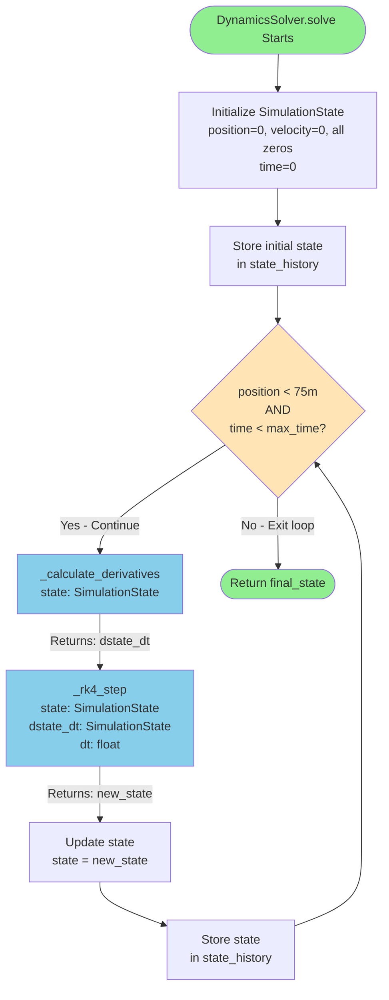
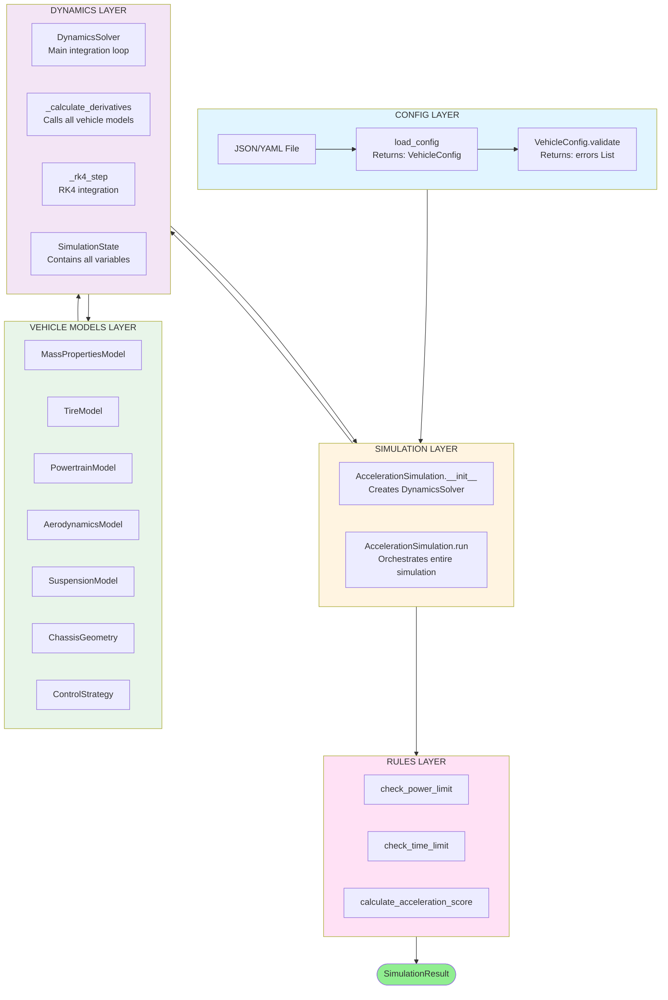

# Mega Diagram: Complete System Data Flow (Fixed Version)

This is a cleaned-up version with proper Mermaid syntax that should parse correctly.

## Main System Flow (High Level)

```mermaid
flowchart TD
    START([Start: JSON/YAML Config File]) --> LOAD_CONFIG["load_config<br/>config_path: str or Path"]
    
    LOAD_CONFIG --> |"Reads file"| PARSE["Parse JSON/YAML<br/>Extract all properties"]
    PARSE --> CREATE_CONFIG["Create VehicleConfig<br/>mass, tires, powertrain, aero, suspension, control, environment"]
    CREATE_CONFIG --> VALIDATE["VehicleConfig.validate<br/>Check: power limit, mass > 0, CG position, tire radius, gear ratio"]
    
    VALIDATE --> |"errors List"| CHECK_ERRORS{"Errors found?"}
    CHECK_ERRORS --> |"Yes"| ERROR([Raise ValueError])
    CHECK_ERRORS --> |"No"| CONFIG_READY["VehicleConfig Object<br/>Validated"]
    
    CONFIG_READY --> INIT_SIM["AccelerationSimulation.__init__<br/>config: VehicleConfig"]
    
    INIT_SIM --> CREATE_SOLVER["Create DynamicsSolver<br/>config: VehicleConfig"]
    
    CREATE_SOLVER --> INIT_MODELS["Initialize Vehicle Models:<br/>MassPropertiesModel, TireModel, PowertrainModel,<br/>AerodynamicsModel, SuspensionModel,<br/>ChassisGeometry, ControlStrategy"]
    
    INIT_MODELS --> SOLVER_READY["DynamicsSolver Ready"]
    SOLVER_READY --> RUN_SIM["AccelerationSimulation.run<br/>fastest_time: Optional float"]
    
    RUN_SIM --> SOLVE["DynamicsSolver.solve<br/>Loop until position >= 75m"]
    
    SOLVE --> |"Returns final_state"| CHECK_POWER["check_power_limit<br/>state_history: List of SimulationState<br/>max_power: 80e3 W"]
    
    CHECK_POWER --> |"Returns: compliant, max_power, violation_time"| CHECK_TIME["check_time_limit<br/>final_state: SimulationState<br/>max_time: 25.0s"]
    
    CHECK_TIME --> |"Returns: compliant, final_time"| CALC_SCORE{"fastest_time provided?"}
    
    CALC_SCORE --> |"Yes"| SCORE["calculate_acceleration_score<br/>team_time: final_state.time<br/>fastest_time: float<br/>max_points: 75.0"]
    CALC_SCORE --> |"No"| NO_SCORE["score = None"]
    
    SCORE --> |"Returns: score"| CREATE_RESULT["Create SimulationResult<br/>final_state, compliant flags, max_power,<br/>final_time, final_distance, final_velocity, score"]
    NO_SCORE --> CREATE_RESULT
    
    CREATE_RESULT --> END([End: Return SimulationResult])

    style START fill:#90EE90
    style END fill:#90EE90
    style ERROR fill:#FFB6C6
    style SOLVE fill:#87CEEB
    style INIT_MODELS fill:#FFE4B5
```

---

## Detailed Solver Loop Expansion

---

## Complete Timestep Detail: _calculate_derivatives()

```mermaid
flowchart TD
    DERIV_START(["_calculate_derivatives<br/>Input: state"]) --> AERO["AerodynamicsModel.calculate_forces<br/>velocity: state.velocity"]
    
    AERO --> |"Returns: drag_force, downforce_front, downforce_rear"| MASS_GUESS["MassPropertiesModel.calculate_normal_forces<br/>acceleration: state.acceleration<br/>front_downforce: downforce_front<br/>rear_downforce: downforce_rear"]
    
    MASS_GUESS --> |"Returns: normal_front, normal_rear<br/>First approximation"| WHEEL_SPEED["Calculate wheel speeds<br/>front: velocity / tire_radius<br/>rear: state.wheel_angular_velocity_rear"]
    
    WHEEL_SPEED --> SLIP_FRONT["TireModel.calculate_slip_ratio<br/>wheel_speed_front, vehicle_velocity"]
    WHEEL_SPEED --> SLIP_REAR["TireModel.calculate_slip_ratio<br/>wheel_speed_rear, vehicle_velocity"]
    
    SLIP_FRONT --> |"Returns: slip_front"| TIRE_FRONT["TireModel.calculate_longitudinal_force<br/>normal_front, slip_front, velocity"]
    SLIP_REAR --> |"Returns: slip_rear"| TIRE_REAR["TireModel.calculate_longitudinal_force<br/>normal_rear, slip_rear, velocity"]
    
    TIRE_FRONT --> |"Returns: tire_force_front, rr_front"| TIRE_FORCES["Collect Tire Forces"]
    TIRE_REAR --> |"Returns: tire_force_rear, rr_rear"| TIRE_FORCES
    
    TIRE_FORCES --> MOTOR_SPEED["PowertrainModel.calculate_motor_speed<br/>wheel_speed_rear"]
    
    MOTOR_SPEED --> |"Returns: motor_speed"| REQ_TORQUE["_calculate_requested_torque<br/>state, normal_rear"]
    
    REQ_TORQUE --> |"Returns: requested_torque"| POWERTRAIN["PowertrainModel.calculate_torque<br/>requested_torque, motor_speed, vehicle_velocity<br/>Applies: current limit, speed limit, 80kW power limit"]
    
    POWERTRAIN --> |"Returns: wheel_torque, motor_current, power_consumed"| TORQUE_TO_FORCE["Convert torque to force<br/>drive_force = wheel_torque / tire_radius"]
    
    TORQUE_TO_FORCE --> |"drive_force_rear"| NET_FORCE["Calculate Net Force<br/>net_force = drive_force + drag_force + rolling_resistance<br/>Note: drag and rolling_resistance are negative"]
    
    NET_FORCE --> |"net_force"| ACCELERATION["Calculate Acceleration<br/>acceleration = net_force / mass"]
    
    ACCELERATION --> |"acceleration: float"| MASS_ACTUAL["MassPropertiesModel.calculate_normal_forces<br/>acceleration: actual_acceleration<br/>front_downforce: downforce_front<br/>rear_downforce: downforce_rear<br/>Recalculate with actual acceleration"]
    
    MASS_ACTUAL --> |"Returns: normal_front, normal_rear<br/>Final values"| WHEEL_ALPHA["Calculate Wheel Angular Acceleration<br/>wheel_alpha_rear = torque - tire_force / inertia"]
    
    WHEEL_ALPHA --> |"wheel_alpha_rear"| CREATE_DSTATE["Create Derivative State<br/>dstate.velocity = acceleration<br/>dstate.position = velocity<br/>dstate.wheel_angular_velocity_rear = wheel_alpha_rear<br/>All forces, currents, powers stored"]
    
    CREATE_DSTATE --> DERIV_END([Return: dstate_dt<br/>SimulationState with derivatives])
    
    style DERIV_START fill:#90EE90
    style DERIV_END fill:#90EE90
    style AERO fill:#FFE4B5
    style TIRE_FRONT fill:#FFE4B5
    style TIRE_REAR fill:#FFE4B5
    style POWERTRAIN fill:#FFE4B5
    style MASS_ACTUAL fill:#FFE4B5
    style ACCELERATION fill:#FF6B6B
```

---

## Complete System Overview

