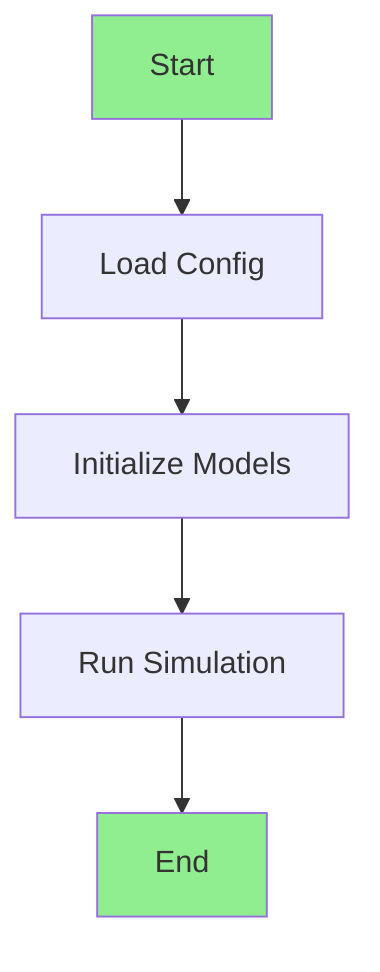

# Mermaid Diagram Test

If you can see a flowchart below with boxes and arrows, Mermaid is working! 🎉

---

## If the diagram above renders:

✅ **Mermaid is working!** You can view all diagrams in `MEGA_DIAGRAM.md` using markdown preview.

---

## If you see code instead of a diagram:

❌ **Mermaid not supported** - Use `MEGA_DIAGRAM_TEXT.md` for text-based visualization instead.

---

## Quick Check:

Try opening this file and pressing `Cmd+Shift+V` (Mac) or `Ctrl+Shift+V` (Windows) to see the preview.

