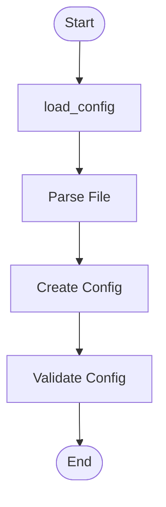

# Test Diagram - Minimal Version

Testing if this simple version works:

```mermaid
flowchart TD
    START([Start]) --> LOAD[load_config]
    LOAD --> PARSE[Parse File]
    PARSE --> CREATE[Create Config]
    CREATE --> VALID[Validate Config]
    VALID --> END([End])
```

If this works, the issue is with more complex labels.

