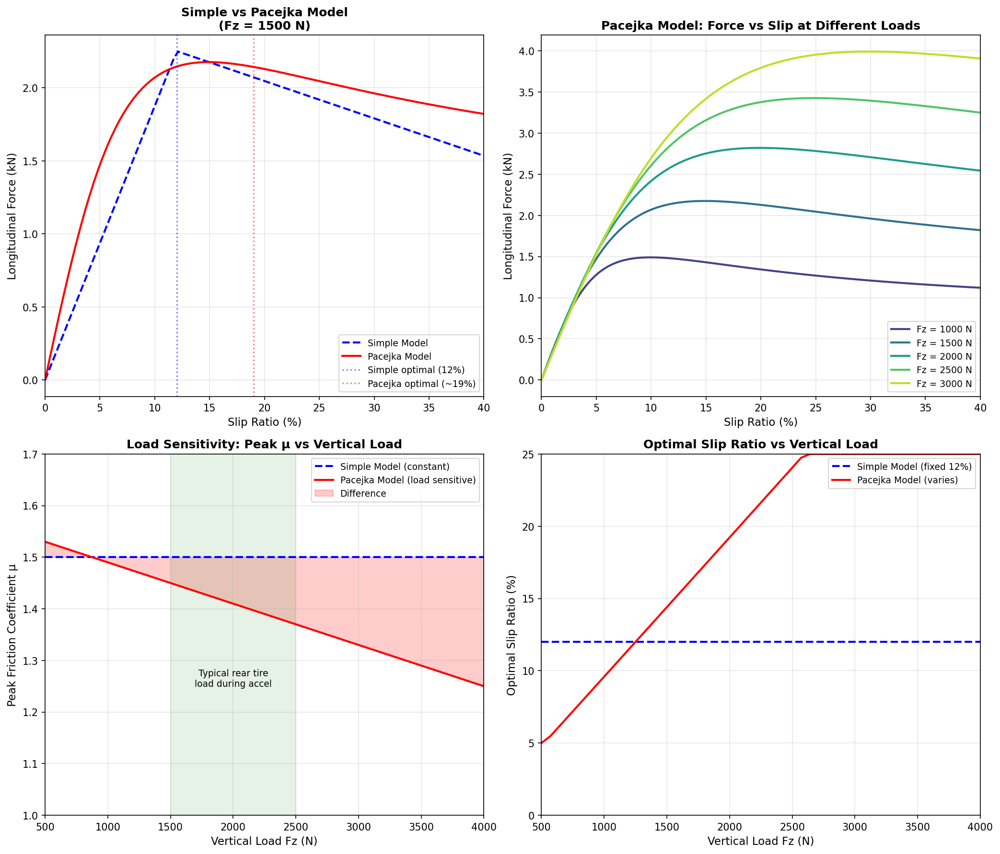

# Presentation Slides: Simulation Results & Design Optimisation

---

## Slide 1: Simulation Results

### Title
"Key Outputs from the Simulation"

### Figure

### What Each Panel Shows

| Panel | What It Shows |
|-------|---------------|
| Position vs Time | Both configs reach 75m, supercap 25ms faster |
| Velocity vs Time | Continuous acceleration to 134-136 km/h |
| Acceleration vs Time | Smooth ramp to traction-limited (~13 m/s²) → power-limited |
| DC Bus Voltage | Battery constant 600V, supercap drops to 445V |
| Power vs Time | Both hit and maintain 80 kW FS limit |
| State of Charge | Battery ~99%, supercap drops to ~54% |

### Key Results

| Metric | Battery | Supercapacitor |
|--------|---------|----------------|
| **75m Time** | 3.582 s | 3.557 s |
| **Final Velocity** | 133.9 km/h | 136.3 km/h |
| **Mass** | 200 kg | 180 kg |
| **Grip Utilization** | 98% (traction phase) | 98% (traction phase) |

**Winner: Supercapacitor** — 25 ms faster (20 kg mass advantage outweighs voltage droop)

### Talking Points
- "Two acceleration phases: traction-limited (~13 m/s²) at launch, then power-limited at 80 kW"
- "Pacejka model with proper wheel dynamics achieves 98% grip utilization"
- "Supercapacitor voltage drops 600V → 445V but still wins due to lower mass"

---

## Slide 2: Model Improvements & Optimisation

### Title
"Pacejka Tire Model and Gear Ratio Optimisation"

### Tire Model: Simple → Pacejka

**What each panel shows:**
- **Top-left:** Simple vs Pacejka force curves — different shapes and optimal slip points
- **Top-right:** Pacejka at different loads — force increases but not linearly
- **Bottom-left:** Load sensitivity — μ decreases as load increases (key improvement)
- **Bottom-right:** Optimal slip varies with load in Pacejka model

**Key insight:** Under hard acceleration, weight transfers to rear → Fz increases → μ decreases. Pacejka captures this diminishing returns effect that the simple model missed.

---

### Gear Ratio Optimisation

**Why does the plateau exist (GR 3.0–5.0)?**

| Phase | What Limits Acceleration | Does GR Matter? |
|-------|-------------------------|-----------------|
| Launch | Tire grip | No — motor has excess torque |
| Mid-run | 80 kW power limit | No — P = F×v regardless of GR |
| High speed | Motor RPM limit | **Yes — only if GR > 5.0** |

**Practical optimum: GR = 4.5** — motor at 95% utilization at finish, avoids speed limit.

### Talking Points
- "Upgraded to Pacejka model for realistic load-sensitive tire behavior"
- "Bottom-left plot shows the key improvement: friction drops as load increases"
- "Gear ratio doesn't affect time in plateau — limited by traction or power"
- "GR = 4.5 is optimal: motor fully utilized without hitting RPM limit"

---

## Summary

| Parameter | Battery | Supercapacitor |
|-----------|---------|----------------|
| 75m Time | 3.582 s | 3.557 s |
| Optimal Gear Ratio | 4.5 | 4.5 |
| Final Velocity | 133.9 km/h | 136.3 km/h |
| Grip Utilization | 98% | 98% |

**Overall Winner: Supercapacitor** — 25 ms faster

---

## Figures

### Figure 1: Energy Storage Comparison

### Figure 2: Pacejka Tire Model (Comprehensive)

### Figure 3: Gear Ratio vs Time

