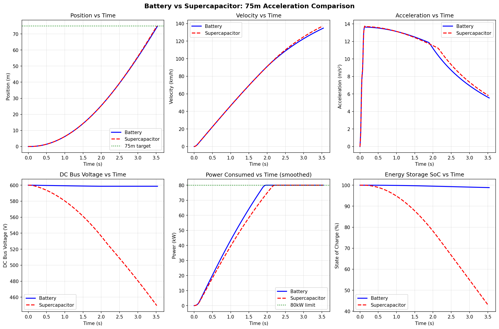
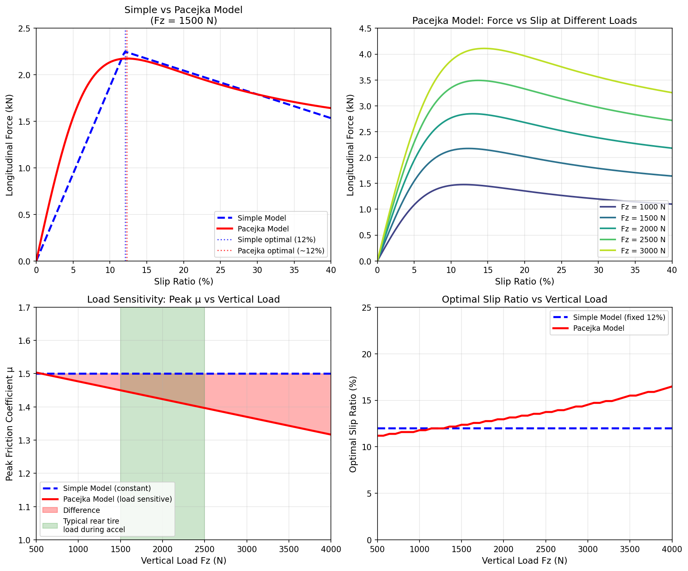
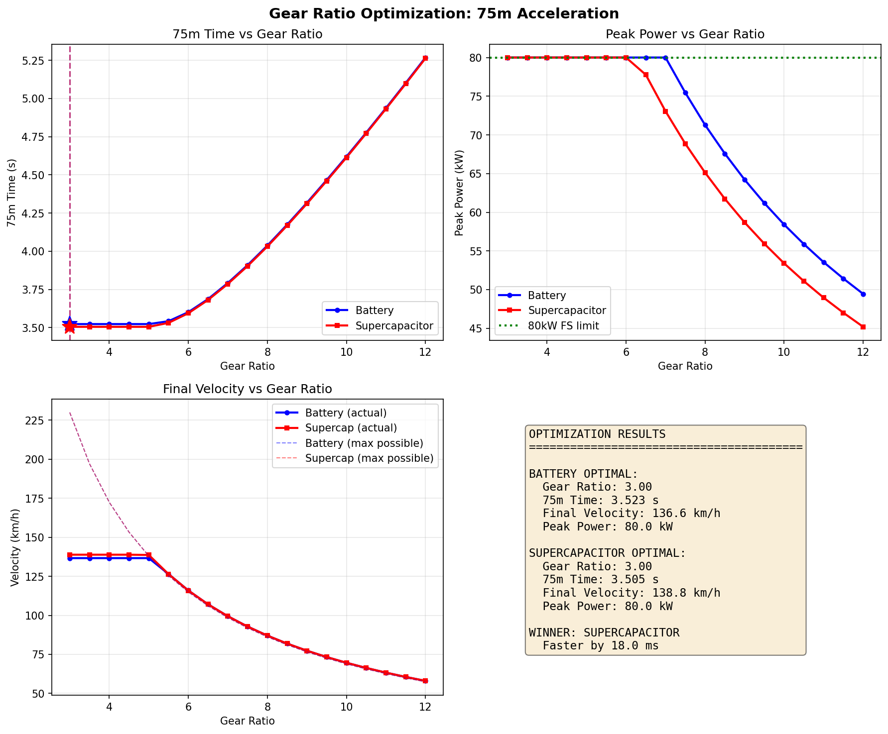
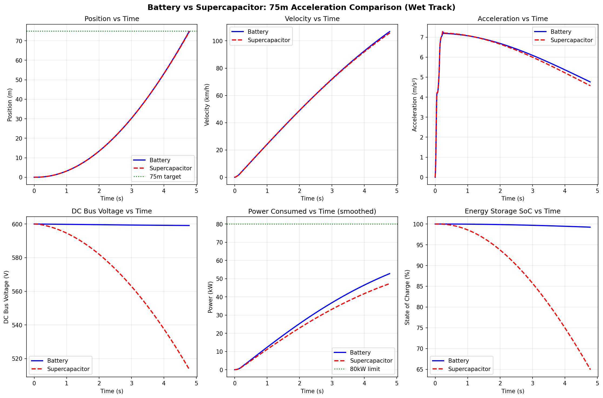

# Presentation Slides: Simulation Results & Design Optimisation

---

## Slide 1: Simulation Results

### Title
"Key Outputs from the Simulation"

### Figure

### What Each Panel Shows

| Panel | What It Shows |
|-------|---------------|
| Position vs Time | Both configs reach 75m, supercap 25ms faster |
| Velocity vs Time | Continuous acceleration to 134-136 km/h |
| Acceleration vs Time | Smooth ramp to traction-limited (~13 m/s²) → power-limited |
| DC Bus Voltage | Battery constant 600V, supercap drops to 445V |
| Power vs Time | Both hit and maintain 80 kW FS limit |
| State of Charge | Battery ~99%, supercap drops to ~54% |

### Key Results

| Metric | Battery | Supercapacitor |
|--------|---------|----------------|
| **75m Time** | 3.582 s | 3.557 s |
| **Final Velocity** | 133.9 km/h | 136.3 km/h |
| **Mass** | 200 kg | 180 kg |
| **Grip Utilization** | 98% (traction phase) | 98% (traction phase) |

**Winner: Supercapacitor** — 25 ms faster (20 kg mass advantage outweighs voltage droop)

### Talking Points
- "Two acceleration phases: traction-limited (~13 m/s²) at launch, then power-limited at 80 kW"
- "Pacejka model with proper wheel dynamics achieves 98% grip utilization"
- "Supercapacitor voltage drops 600V → 445V but still wins due to lower mass"

---

## Slide 2: Model Improvements & Optimisation

### Title
"Pacejka Tire Model and Gear Ratio Optimisation"

### Tire Model: Simple → Pacejka

**What each panel shows:**
- **Top-left:** Simple vs Pacejka force curves — both peak at ~12% slip, Pacejka has smoother post-peak drop
- **Top-right:** Pacejka at different loads — force increases, peaks shift slightly right with load
- **Bottom-left:** Load sensitivity — μ decreases as load increases (key improvement over simple model)
- **Bottom-right:** Optimal slip varies mildly with load (~11% at 500N → ~15% at 3500N) vs fixed 12% for simple

**Key insight:** Under hard acceleration, weight transfers to rear → Fz increases → μ decreases. Pacejka captures this diminishing returns effect that the simple model missed.

---

### Gear Ratio Optimisation

**Why does the plateau exist (GR 3.0–5.0)?**

| Phase | What Limits Acceleration | Does GR Matter? |
|-------|-------------------------|-----------------|
| Launch | Tire grip | No — motor has excess torque |
| Mid-run | 80 kW power limit | No — P = F×v regardless of GR |
| High speed | Motor RPM limit | **Yes — only if GR > 5.0** |

**Practical optimum: GR = 4.5** — motor at 95% utilization at finish, avoids speed limit.

### Talking Points
- "Upgraded to Pacejka model for realistic load-sensitive tire behavior"
- "Bottom-left plot shows the key improvement: friction drops as load increases"
- "Gear ratio doesn't affect time in plateau — limited by traction or power"
- "GR = 4.5 is optimal: motor fully utilized without hitting RPM limit"

---

## Slide 3: Simulation vs Reality — Oxford Brookes Comparison

### Title
"Why Our Simulation (3.56 s) vs Oxford Brookes (4.28 s)?"

### The Gap
| Metric | Our Simulation | Oxford Brookes (FS UK 2025) |
|--------|----------------|------------------------------|
| **75m Time** | 3.557 s (supercap) | 4.284 s |
| **Difference** | — | ~0.7 s slower in reality |

### Factors Explaining the Gap

| Factor | Effect | Typical contribution |
|--------|--------|----------------------|
| **Reaction + staging** | Green light to first motion | 0.25–0.40 s |
| **Extra mass** | Driver + fluids (we model car only) | 0.10–0.15 s |
| **Non-ideal traction** | Wheelspin, cold tires, TC overshoot | 0.10–0.20 s |
| **Other losses** | Transients, voltage sag, derating | 0.10–0.20 s |

### Simulation Assumptions (Ideal)

- No reaction time — acceleration starts at t = 0
- Car mass only (180–200 kg) — no driver
- Perfect traction — optimal slip, no wheelspin
- Instant torque response — no motor/inverter delay

### Talking Points
- "Simulation is an ideal, repeatable run — real events include human and environmental factors"
- "~0.7 s gap is consistent with reaction time, driver mass, and real-world losses"
- "Oxford Brookes 4.28 s is fastest FS UK 2025 — our sim shows theoretical potential"

---

## Slide 4: Wet Track (Battery vs Supercapacitor)

### Title
"Wet Track: Battery vs Supercapacitor (same 6-panel layout)"

### Figure

### Results (Wet, μ = 0.6)

| Metric | Battery | Supercapacitor |
|--------|---------|----------------|
| **75m Time** | 4.843 s | 4.849 s |
| **Final Velocity** | ~106 km/h | ~106 km/h |

### Implementation

- `surface_mu_scaling` applied to μ_peak in Pacejka model (not final force)
- Toggle: set `surface_mu_scaling: 0.6` in config for wet (1.0 = dry)

### Talking Points
- "Same 6-panel layout as dry — Battery vs Supercapacitor under wet conditions"
- "Wet adds ~1.3 s to 75m run — traction-limited for longer"

---

## Summary

| Parameter | Battery | Supercapacitor |
|-----------|---------|----------------|
| 75m Time | 3.582 s | 3.557 s |
| Optimal Gear Ratio | 4.5 | 4.5 |
| Final Velocity | 133.9 km/h | 136.3 km/h |
| Grip Utilization | 98% | 98% |

**Overall Winner: Supercapacitor** — 25 ms faster

---

## Figures

### Figure 1: Energy Storage Comparison

### Figure 2: Simple vs Pacejka Tire Model

### Figure 3: Gear Ratio vs Time

### Figure 4: Battery vs Supercapacitor (Wet)

