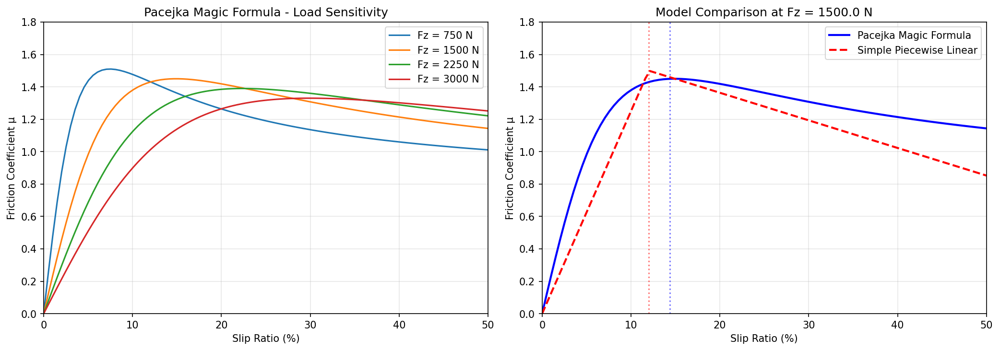
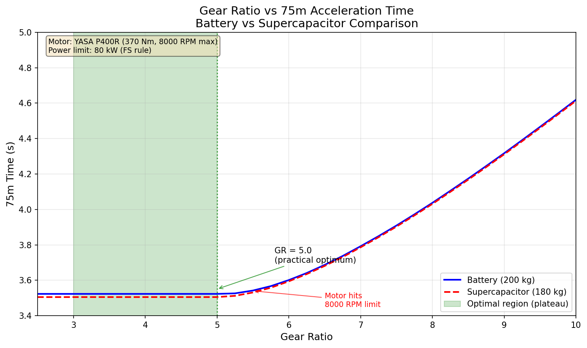
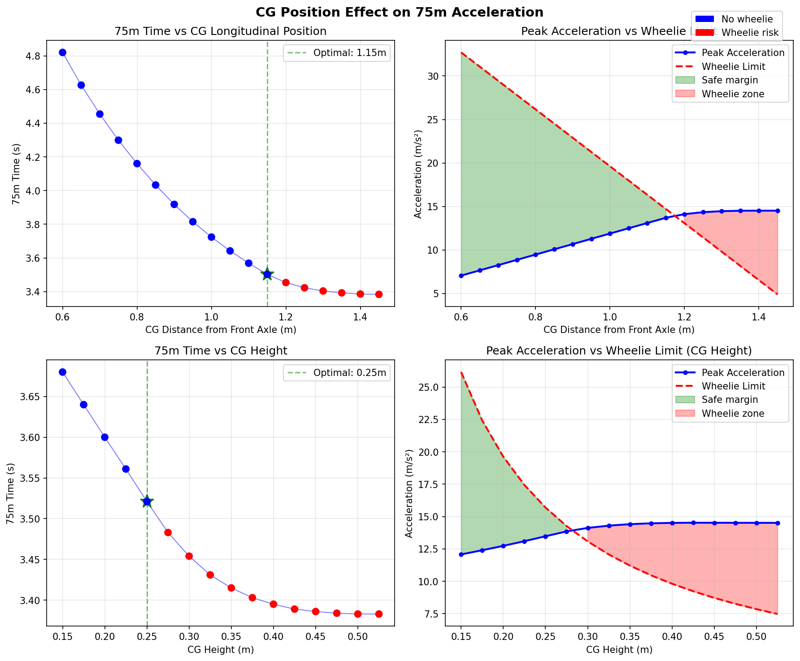

# Presentation Slides: Simulation Results & Design Optimisation

---

## Slide 1: Simulation Results

### Title
"Key Outputs from the Simulation"

### Main Message
The simulation produces time-series data showing how the vehicle behaves throughout the 75m acceleration run, allowing us to verify physics, check rule compliance, and understand performance limits.

### Recommended Figure

### Explanation of Key Features

#### Velocity vs Time — Why the curves diverge?

**Both vehicles** accelerate from 0 at optimal gear ratio (5.0):
- At this gear ratio, motor operates at ~99% of max speed at finish
- Both vehicles accelerate continuously, just reaching motor speed limit at 75m
- Final velocities: Battery 136.6 km/h, Supercap 138.6 km/h

**Supercapacitor (red)** reaches higher velocity because:
- 20 kg lighter (180 kg vs 200 kg)
- Higher acceleration throughout the run
- Crosses 75m at higher speed

#### Acceleration vs Time — Why does it drop?

Both curves show acceleration starting at ~13 m/s² and dropping smoothly. The run has **two phases**:

**Phase 1 — Torque-limited (0 to ~2.2s):**
- Motor produces peak torque (370 Nm)
- Power ramps up as P = T × ω
- Acceleration limited by available motor torque

**Phase 2 — Power-limited (~2.2s to finish):**
- The 80 kW FS power limit is reached
- Acceleration follows: **a = P / (m × v)**
- As velocity increases, acceleration decreases hyperbolically

**Why supercapacitor has higher acceleration:**
- Same 80 kW power limit
- But lower mass (180 kg vs 200 kg)
- So a = P/(m×v) gives higher acceleration at any given velocity

#### DC Bus Voltage — The key difference

- **Battery:** Constant 600V throughout (slight sag under load, but negligible)
- **Supercapacitor:** Drops from 600V → 455V as energy is discharged
  - This is the fundamental E = ½CV² relationship
  - Voltage drop affects motor field weakening threshold
  - But the 20 kg mass saving more than compensates

#### Power vs Time — Both hit 80kW limit

- **Both configurations** reach and maintain 80 kW (the FS power limit)
- Power is calculated correctly as P_electrical = P_mechanical / efficiency
- Both maintain 80 kW throughout the power-limited phase

### Summary Table

| Panel | What It Shows |
|-------|---------------|
| Position vs Time | Both configs reach 75m, supercap ~18ms faster |
| Velocity vs Time | Continuous acceleration, supercap reaches 138.8 km/h vs 136.6 km/h |
| Acceleration vs Time | Two phases: torque-limited then power-limited, supercap higher due to lower mass |
| DC Bus Voltage vs Time | Battery constant 600V, supercap drops 600V→455V |
| Power vs Time | Both hit 80 kW limit and maintain it |
| State of Charge vs Time | Battery ~99%, supercap drops to ~54% |

### Key Results (at optimal gear ratio 5.0)

| Metric | Battery | Supercapacitor |
|--------|---------|----------------|
| **75m Time** | 3.523 s | 3.505 s |
| **Final Velocity** | 136.6 km/h | 138.6 km/h |
| **Peak Power** | 80.0 kW | 80.0 kW |
| **Mass** | 200 kg | 180 kg |
| **Gear Ratio** | 5.0 | 5.0 |
| **Motor Speed @ Finish** | 7927 RPM (99%) | 8044 RPM (100%) |

**Winner: Supercapacitor** — faster by 18 ms (lighter weight compensates for voltage droop)

### Talking Points

- "The simulation outputs time-series data for all key variables"
- "Both configurations stay within the 80 kW FS power limit"
- "The supercapacitor voltage drops from 600V to 455V during the run"
- "Despite voltage droop, supercap wins due to 20 kg mass advantage"
- "At optimal gear ratio 5.0, the difference is 18 ms"
- "Motor operates at ~99% of max speed — fully utilized without hitting limit"

---

## Slide 2: Tire Model Evolution — Simple to Pacejka

### Title
"Improving Simulation Fidelity with the Pacejka Magic Formula"

### Main Message
Upgrading from a simple linear tire model to the Pacejka Magic Formula provides realistic grip behavior including load sensitivity — critical for accurate acceleration simulation.

### Recommended Figure

---

### Why Tire Modeling Matters

In the 75m acceleration event, tire grip determines:
- **Launch performance** — maximum traction at low speed
- **Weight transfer effects** — how load changes affect grip
- **Traction control tuning** — optimal slip ratio target

---

### Simple Model vs Pacejka Model

| Feature | Simple Model | Pacejka Model |
|---------|--------------|---------------|
| **Friction curve** | Linear ramp to peak, then linear drop | Smooth S-curve (Magic Formula) |
| **Load sensitivity** | None (μ constant) | μ decreases as Fz increases |
| **Peak location** | Fixed slip ratio | Varies with load |
| **Physical basis** | Approximation | Empirical fit to real tire data |

---

### The Pacejka Magic Formula

The longitudinal force is calculated as:

**Fx = D × sin(C × arctan(B×κ − E×(B×κ − arctan(B×κ))))**

Where:
- **κ** = slip ratio (wheel speed vs vehicle speed)
- **B** = stiffness factor (slope at origin)
- **C** = shape factor (typically 1.5-1.9 for longitudinal)
- **D** = peak value = μ_peak × Fz (with load sensitivity)
- **E** = curvature factor (shape after peak)

---

### Load Sensitivity — The Key Improvement

**What the plot shows:**
- Multiple curves for different vertical loads (Fz)
- As load increases, peak friction coefficient **decreases**
- This is real tire behavior — captured by Pacejka, missed by simple model

**Coefficients used (based on Avon FSAE tire data):**

| Parameter | Value | Meaning |
|-----------|-------|---------|
| pDx1 | 1.45 | Peak μ at nominal load |
| pDx2 | -0.12 | Load sensitivity (μ drops with load) |
| C | 1.65 | Shape factor |
| Fz0 | 1500 N | Nominal load |

---

### Impact on Simulation Results

| Aspect | Simple Model | Pacejka Model |
|--------|--------------|---------------|
| Peak μ at 1500N | 1.5 (fixed) | 1.45 |
| Peak μ at 2500N | 1.5 (fixed) | 1.33 (load sensitive) |
| Optimal slip | 12% (fixed) | 19% (varies with load) |
| Weight transfer effect | Underestimated | Correctly modeled |

**Key insight:** Under hard acceleration, weight transfers to rear tires (Fz increases). The Pacejka model correctly shows that grip doesn't scale linearly — you get diminishing returns as load increases.

---

### Talking Points

- "We upgraded from a simple linear model to the Pacejka Magic Formula"
- "The key improvement is load sensitivity — friction coefficient decreases as load increases"
- "This matters because weight transfer during acceleration increases rear tire load significantly"
- "The model is based on Avon FSAE tire data with estimated longitudinal coefficients"
- "Optimal slip ratio is ~19% — this informs our traction control target"

---

## Slide 3: Design Optimisation

### Title
"Using the Simulation for Informed Design Decisions"

### Main Message
The simulation enables us to make informed decisions about key design parameters by sweeping through options and finding optimal configurations.

### Three Key Design Decisions

| Decision | Trade-off | Figure |
|----------|-----------|--------|
| **1. Gear Ratio** | Torque multiplication vs motor speed limit | `gear_ratio_vs_time.png` |
| **2. Energy Storage** | Constant voltage vs lighter weight | `energy_storage_comparison.png` |
| **3. CG Position** | Rear grip vs wheelie risk | `cg_position_sweep.png` |

---

### Decision 1: Gear Ratio Optimization

| Config | Optimal Gear Ratio | 75m Time | Final Velocity |
|--------|-------------------|----------|----------------|
| Battery | 5.0 | 3.523 s | 136.6 km/h |
| Supercapacitor | 5.0 | 3.505 s | 138.6 km/h |

**Key insight:** The optimal gear ratio is a RANGE (3.0 to 5.0), all giving the same time.

**Why does the plateau exist?**
- **Traction-limited phase (launch):** Tire grip limits acceleration, not motor torque. Even at GR=3.0, the motor has more torque than the tires can use.
- **Power-limited phase (mid-run):** The 80kW FS limit caps acceleration. GR doesn't matter because P = F × v — same power to wheels regardless of gear ratio.
- **GR only matters when it becomes the bottleneck:** At GR > 5.0, motor hits 8000 RPM before 75m.

**Practical optimum: GR = 5.0**
- Motor at 99% of max speed at finish — fully utilized
- Same time as lower gear ratios, but with lower drivetrain torque loads

---

### Decision 2: Energy Storage Type

Already covered in Slide 1. Key insight:
- Supercapacitor wins by **18 ms** despite voltage droop (600V → 455V)
- 20 kg mass saving outweighs the voltage drop effects

---

### Decision 3: CG Position

| Parameter | Optimal Value | 75m Time | Constraint |
|-----------|---------------|----------|------------|
| CG longitudinal (cg_x) | 1.15 m | 3.503 s | Wheelie limit |
| CG height (cg_z) | 0.25 m | 3.521 s | Wheelie limit |

**Key insights:**

**CG Longitudinal Position (cg_x):**
- Further back = more rear grip = faster
- But: too far back → wheelie risk
- Optimal: 1.15m from front axle (72% rear weight bias)

**CG Height (cg_z):**
- Higher CG = more load transfer = more rear grip
- But: higher CG = lower wheelie threshold
- Optimal: 0.25m

---

### Talking Points

- "Gear ratio doesn't affect time in the plateau because acceleration is limited by traction or power, not motor speed"
- "GR=5.0 is optimal — motor at 99% utilization, same time as lower ratios"
- "Above GR=5.0, the motor speed limit becomes the bottleneck and time increases"
- "CG position is constrained by wheelie — we can't just move everything to the rear"

---

## Summary of Key Numbers

| Parameter | Battery | Supercapacitor |
|-----------|---------|----------------|
| 75m Time | 3.523 s | 3.505 s |
| Optimal Gear Ratio | 5.0 | 5.0 |
| Final Velocity | 136.6 km/h | 138.6 km/h |
| Motor Speed @ Finish | 7927 RPM (99%) | 8044 RPM (100%) |
| Mass | 200 kg | 180 kg |
| Initial Voltage | 600 V | 600 V |
| Final Voltage | ~600 V | 455 V |

**Overall Winner: Supercapacitor** — 18 ms faster (at optimal gear ratios)

---

## All Figures

### Figure 1: Pacejka Tire Model

### Figure 2: Energy Storage Comparison (at optimal GR=5.0)

### Figure 3: Gear Ratio vs Time

### Figure 4: CG Position Sweep

